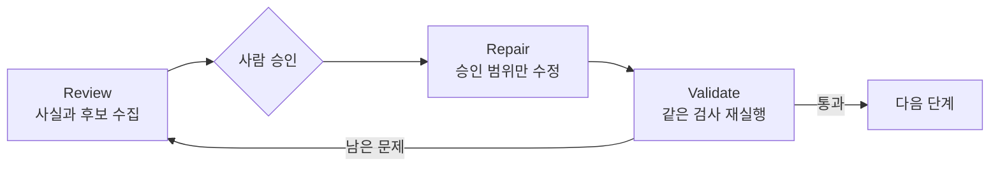

# Lab 11 — Repo 기준 문서 세트 검증과 인계

## 0. 이 랩이 끝나면

- 이 Lab은 새로운 기준을 만드는 Lab이 아니라, 지금까지 만든 기준이 연결되어 작동하는지 검증하고 다음 작업에 인계하는 Lab입니다.
- 기준 문서의 위치·참조·정본을 점검하고 root `AGENTS.md`의 읽기 순서를 최종화합니다.
- 이전 대화와 memory를 배제한 새 세션에서 plan 승인 전 구현 차단이 실제로 작동하는지 확인합니다.
- `notes/session-handoff.md`에 다음 세션의 첫 행동과 현재 상태를 남깁니다.
- 예상 소요 시간은 55분입니다.

Chapter 2 내내 앱 코드를 v0으로 둔 것은 의도한 설계입니다. 정책과 template, prompt를 세우는 동안 코드까지 움직이면 기준이 목표를 설명하지 못하고 그때그때의 구현에 맞춰 휘어질 수 있습니다. Lab 11은 기준 세트가 서로 연결되고 새 세션의 행동을 실제로 제한하는지 확인하는 관문이며, `src/`와 `tests/`는 Lab 12부터 처음 바뀝니다.

## 1. 시작 전 상태 확인

- Lab 02~10의 필수 산출물이 현재 checkout에 모두 있어야 합니다.
- `node labs/tools/check.mjs 10`이 누락 없이 통과해야 합니다.
- `src/`와 `tests/`는 v0 상태이며 diff가 없어야 합니다.
- 실습 시작 시 `git branch --show-current`, `git rev-parse --short HEAD`, `git status --short` 결과를 기록합니다.
- 새 기준 문서를 만들지 않고 기존 문서, root `AGENTS.md`, `notes/session-handoff.md`만 점검·정리합니다.
- Lab 12 입력을 미리 읽거나 구현을 시작하지 않습니다.

## 2. 실습 목표와 산출물

| 단계 | 예상 시간 | 핵심 작업 | 결과 |
| --- | ---: | --- | --- |
| E1 | 약 15분 | 정적 검사와 의미 검토로 문서 관계 점검 | 연결 오류와 정본 후보 분리 |
| E2 | 약 15분 | 요청 유형별 읽기 순서와 새 세션 행동 검증 | root `AGENTS.md` 최종화 |
| E3 | 약 15분 | memory 없는 독립 실행에서 plan-first 차단 시험 | JSONL 실행 기록과 blind 검증 판정 |
| E4 | 약 8분 | 상태와 다음 첫 행동을 인계하고 커밋 | 완성된 handoff와 2개 이하 커밋 |
| Self-check | 약 2분 | 산출물과 앱 코드 청결 확인 | Lab 11 완료 판정 |

```text
E1 문서 세트 연결 확인
→ E2 AGENTS.md 읽기 순서 확인
→ E3 새 세션의 plan-first 행동 확인
→ E4 다음 첫 행동과 상태 인계
→ Lab 12에서 첫 코드 변경
```

파일이 있다는 사실만으로는 기준이 작동하지 않습니다. 올바른 위치에 있고, 다른 문서와 실제로 이어지며, 새 세션이 그 연결을 따라 행동해야 합니다.

## 3. 실습

### E1. 기준 문서 풀세트 배치 점검

점검 대상은 다음과 같습니다. 같은 기준의 정본이 두 곳에 있으면 정본이 없는 것과 같습니다. 한 곳만 정본으로 남기고 다른 문서는 그 경로를 가리키게 합니다.

| 묶음 | 점검할 경로 |
| --- | --- |
| Repo 진입점 | `AGENTS.md` |
| Chapter 1 요청·결정 | `notes/order-status-request.md`, `notes/pending-decisions.md`, `notes/next-actions.md` |
| Chapter 1 경계·계획·인계 | `notes/task-boundary.md`, `notes/order-status-plan.md`, `notes/small-development-workflow.md` |
| Chapter 1 재사용 구조 | `docs/templates/workflow-skeleton.md` |
| 도메인 정책 | `docs/order-policy.md`, `docs/payment-policy.md`, `docs/inventory-policy.md` |
| Issue 구조와 작업 기록 | `.github/ISSUE_TEMPLATE/workflow-task.md`, `notes/issue-draft-l08.md` |
| 구현 계획 구조 | `docs/templates/implementation-plan.md` |
| 반복 작업 prompt | `docs/prompts/test-generation.md`, `docs/prompts/pr-description.md`, `docs/prompts/self-review.md` |

이 단계는 검사를 두 층으로 나눕니다. 검사기는 파일 존재·경로 분류·깨진 참조처럼 같은 입력에서 같은 결과가 나오는 사실을 확인하고, Codex는 원문을 읽어 정본·중복·충돌처럼 의미가 필요한 판단 후보를 찾습니다. 현업의 link checker·CODEOWNERS·software catalog도 각각 연결·책임·관계를 나눠 다루지만, 이 Lab에서는 같은 원리만 기존 Node 검사기에 작게 적용하고 외부 패키지나 별도 그래프 시스템은 추가하지 않습니다.

#### 개념 1 — Review, Repair, Validate를 분리한다

[OpenAI의 iterative repair loop](https://developers.openai.com/cookbook/examples/codex/build_iterative_repair_loops_with_codex)는 문서 유지보수를 `Review → Repair → Validate`로 나눕니다. Review는 파일을 바꾸지 않고 구조화된 발견 사항을 만들고, Repair는 승인된 발견만 최소 수정하며, Validate는 실행 가능한 검사로 남은 문제를 다시 측정합니다. 한 요청에 세 역할을 섞지 않아야 “문제를 찾았다”와 “문제를 해결했다”를 혼동하지 않습니다.



| 단계 | 산출물 | 이 단계에서 하지 않는 것 |
| --- | --- | --- |
| Review | 깨진 참조, 연결 검토 후보, 중복·충돌 후보 | 파일 수정, 정본 확정 |
| Repair | 사람이 승인한 최소 문서 수정 | 새 정책 추가, 범위 확대 |
| Validate | 같은 명령의 재실행 결과와 남은 차이 | 결과를 느낌으로 판정 |

#### 개념 2 — 참조와 의미 관계는 다르다

검사기는 문서 안에 경로가 적혀 있다는 구문 사실을 찾아 `source --references--> target`으로 출력합니다. 하지만 같은 링크도 “이 정책을 읽어라”, “이 결정에서 나왔다”, “이 template으로 만들었다”처럼 의미가 다를 수 있습니다. 그래서 Codex가 원문 근거를 읽고 다음 네 관계 중 하나로 분류하며, 근거가 없으면 관계를 만들지 않습니다.

| 관계 | 뜻 | 대표 형태 |
| --- | --- | --- |
| `routes-to` | 요청 유형을 적용할 정책이나 절차로 보냄 | `AGENTS.md → 정책 문서` |
| `uses-as-input` | 작성이나 판단 전에 읽을 자료를 가리킴 | `계획 또는 정책 → 근거 문서` |
| `instantiates` | 재사용 template을 실제 작업 산출물로 채움 | `Issue draft → Issue template` |
| `records` | 요청, 결정 또는 실행 결과를 작업 기록으로 남김 | `작업 note → 이전 단계의 입력` |

관계는 방향이 있습니다. `A routes-to B`라고 해서 `B routes-to A`가 되는 것은 아닙니다. 또한 참조가 없는 문서는 즉시 삭제할 파일이 아니라, 독립 문서인지 연결이 빠진 문서인지 확인할 후보입니다.

정본은 링크를 가장 많이 받은 문서가 아니라, 해당 판단을 최종적으로 책임지도록 사람이 승인한 문서입니다. 다른 문서는 정본의 문장을 복사하지 않고 경로와 적용 조건만 가리켜야 합니다. 그래프는 후보를 좁히지만 권한까지 결정하지는 않습니다.

#### 개념 3 — 자동화의 판정 경계를 정한다

| 검사 층 | 잘 판정하는 것 | 판정하지 않는 것 |
| --- | --- | --- |
| Node 검사기 | 파일 존재, 경로 분류, 참조 대상 존재, 명시적 연결 | 정책 의미, 정본, 내용 충돌 |
| Codex 검토 | 관계 의미, 중복·충돌 후보, 빠진 routing 후보 | 사람 대신 정본 확정 |
| 사람 승인 | 정본과 수정 범위, 경고 처리 | 확인하지 않은 내용을 자동 통과 |

`PASS`는 해당 층의 검사만 통과했다는 뜻입니다. 파일이 존재한다는 `PASS`는 정책 내용이 맞다는 보증이 아닙니다. `WARN`도 실패와 다릅니다. 자동 판정할 근거가 부족하므로 사람이 볼 대상을 좁혔다는 뜻입니다.

#### 설계 질문

- 존재·경로처럼 기계가 판정할 사실과 문서 의미처럼 사람이 검토할 판단은 무엇인가요?
- 어느 문서가 다른 문서를 가리키는지 `source → target` 관계로 설명할 수 있나요?
- 연결되지 않은 문서는 오류인가요, 아니면 사람이 용도를 확인할 후보인가요?
- 같은 기준을 둘 이상의 문서가 정본처럼 설명하고 있나요?

#### 실행

먼저 Lab 02~10의 기존 `required` 규칙을 문서 목록으로 재사용하는 정적 검사 명령을 확인합니다. 별도 목록을 만들지 않으므로 README와 검사 목록이 서로 다르게 낡는 것을 줄입니다. 이어지는 요청에서 Codex가 이 명령을 직접 실행하고 결과를 원문과 대조합니다.

```bash
node labs/tools/check.mjs --audit-docs 11
```

`PASS`는 존재와 경로만 보장합니다. `REL`은 원문에서 찾은 명시적 참조이고, `WARN`은 다른 기준 문서와 연결이 보이지 않아 의미 확인이 필요한 후보입니다. 경고를 곧바로 오류나 삭제 대상으로 판단하지 않습니다.

```text
목표: 문서 관계 audit 결과와 원문을 대조해 기계 검사가 판정하지 못한 정본·중복·충돌 후보를 검토한다.
문맥: 먼저 `node labs/tools/check.mjs --audit-docs 11`을 읽기 전용으로 실행하고, 그 결과와 @labs/CONVENTIONS.md, audit에 나온 기준 문서를 사용한다.
제약: 파일을 수정하거나 새 관계를 추측하지 말고, PASS를 정책 내용 검증으로 해석하거나 정본을 임의로 선택하지 않는다.
완료 조건: source·관계(`routes-to`·`uses-as-input`·`instantiates`·`records`)·target·근거 표가 있고, 확인된 연결·연결 검토 후보·중복 또는 충돌·사람이 정할 정본 후보가 구분된다.
```

문제가 있으면 사람이 정본과 수정 범위를 승인한 뒤, 승인한 위치·링크·중복 문제만 기존 문서에서 최소 수정합니다. 신규 기준을 추가하거나 정책 내용을 다시 쓰지 않습니다.

#### 검증

- [ ] 정적 검사 결과가 존재·위치·명시적 참조와 의미 판단을 구분하는가?
- [ ] 관계표의 각 행에 source·관계·target과 원문 근거가 있는가?
- [ ] `WARN`을 자동 실패로 처리하지 않고 연결 필요 여부를 사람이 판정했는가?
- [ ] 중복·충돌과 정본 후보가 분리되어 있고, 정본은 사람이 승인했는가?
- [ ] 승인한 최소 수정 뒤 audit을 다시 실행했고 `src/`, `tests/`가 그대로인가?

### E2. 새 세션 읽기 순서 검증

root `AGENTS.md`는 세부 기준을 복제하는 문서가 아니라 새 세션이 올바른 정본으로 이동하게 하는 진입점입니다.

#### 개념 1 — `AGENTS.md`는 정본이 아니라 routing table

정책은 **무엇이 허용되고 금지되는지**를 정하고, `AGENTS.md`는 **어떤 요청에서 어느 정책을 먼저 읽을지**를 안내합니다. 같은 정책 내용을 두 파일에 복사하면 한쪽이 바뀔 때 다른 쪽이 오래된 기준이 됩니다. 따라서 `AGENTS.md`는 짧은 경로와 적용 조건만 남기는 안내 표여야 합니다. Codex도 작업 전에 `AGENTS.md`를 읽어 지침 체인을 구성하므로, 이 파일은 새 세션의 출발점 역할을 합니다. [AGENTS.md configuration guide](https://learn.chatgpt.com/docs/agent-configuration/agents-md)

| 문서 | 책임 | 넣지 않을 것 |
| --- | --- | --- |
| `AGENTS.md` | 언제, 어느 문서를 읽을지 연결 | 정책의 세부 내용 |
| 정책 문서 | 허용·금지와 판단 기준 | 모든 작업 흐름의 안내 |
| plan template | 계획에 기록할 항목과 승인 경계 | 개별 정책의 답 |

#### 개념 2 — 읽기 순서는 조건에 따라 갈라진다

새 세션이 모든 문서를 처음부터 끝까지 읽게 하는 것이 목표가 아닙니다. 요청의 성격에 따라 먼저 읽을 기준이 달라져야 합니다. 이 연결이 `AGENTS.md`의 routing입니다.

| 요청 유형 | 먼저 읽을 기준 | 함께 확인할 때 |
| --- | --- | --- |
| 주문 상태 변경 | `docs/order-policy.md` | 결제·재고에도 영향을 주면 해당 정책 추가 |
| 결제 변경 | `docs/payment-policy.md` | 상태 전환이 있으면 주문 상태 정책 추가 |
| 재고 변경 | `docs/inventory-policy.md` | 결제 또는 주문 상태와 맞물리면 해당 정책 추가 |
| 관리자 조회 변경 | 주문 상태 정책의 관리자 기준 | 결제 실패 정보를 보이면 결제 정책 추가 |


#### 개념 3 — 새 세션 검증은 지식 퀴즈가 아니라 행동 검증

“지침을 요약해 달라”는 답만으로는 충분하지 않습니다. 실제로 어떤 파일을 읽었는지, 요청 유형에 따라 다른 기준으로 갔는지, 구현 대신 계획과 승인 지점에서 멈췄는지가 증거입니다. 이를 cold-start 검증이라고 합니다. 실패하면 새 세션에 정답 경로를 알려 주지 않고, 원래 세션에서 `AGENTS.md`의 연결만 고친 뒤 다시 새 세션으로 확인합니다.

#### 설계 질문

- project overview와 위치 규약은 어떤 순서로 읽어야 하나요?
- 주문 상태·결제·재고·관리자 조회 요청은 각각 어느 정책으로 가야 하나요?
- 실제 구현 전에 implementation plan template을 언제 읽어야 하나요?
- 검증 명령과 최종 보고 순서는 어디에서 확인할 수 있나요?

#### 실행

```text
목표: root AGENTS.md를 새 세션의 읽기 순서와 검증 진입점으로 최종화한다.
문맥: 현재 @AGENTS.md, @labs/CONVENTIONS.md, 세 정책 문서와 @docs/templates/implementation-plan.md를 사용한다.
제약: 세부 문서 전문을 복제하거나 새 기준을 만들지 않고, 경로와 적용 조건만 연결하며 앱 코드는 수정하지 않는다.
완료 조건: project overview, 위치 규약, 네 요청 유형별 정책, plan template, 검증 순서를 찾을 수 있다.
```

같은 checkout의 새 Codex 세션을 열고 다음 요청만 전달합니다.

```text
활성 지침을 요약해줘. 파일은 수정하지 말고, 주문 상태·결제·재고·관리자 조회 변경에서 먼저 읽을 문서를 실제로 확인해라.
어떤 파일을 읽었고 요청 유형에 따라 선택이 어떻게 달라지는지, 계획과 검증은 어떤 순서인지 근거와 함께 보고해라.
```

#### 검증

- [ ] `AGENTS.md`에서 project overview와 위치 규약의 진입점을 찾을 수 있는가?
- [ ] 주문 상태·결제·재고·관리자 조회가 요청 유형에 맞는 서로 다른 정책으로 연결되는가?
- [ ] implementation plan template과 구현 전 승인 조건, 검증 순서가 연결되는가?
- [ ] 새 세션이 실제로 읽은 파일과 요청 유형별 선택 근거를 보고했는가?
- [ ] `AGENTS.md`에는 세부 문서 전문이 아니라 경로와 조건만 있는가?

### E3. Plan 없이 구현하지 않는지 확인

이 단계는 Lab 11의 최종 시험입니다. 이전 대화와 memory가 없는 세션이 저장소 문서만 보고 계획과 승인 지점에서 멈추는지를 확인합니다.

> **경고:** 검증 중 실제 구현을 허용하지 않습니다. Codex가 구현으로 넘어가려 하면 즉시 중단하고, 어느 지침을 놓쳐 넘어갔는지를 관찰 결과로 기록합니다. 구현이 시작되면 blind 검증과 앱 코드 v0 상태가 함께 깨집니다.

#### 개념 1 — Guardrail은 멈추는지를 보는 negative test다

E3의 성공은 Codex가 많은 일을 하는 것이 아니라, 범위가 넓은 요청을 받아도 구현하지 않고 계획과 사람 승인 지점에서 멈추는 것입니다. 새 세션에 문서 경로나 정답을 보충하면 저장소의 지침이 아니라 추가 prompt의 도움을 검사하게 됩니다. 실패했을 때도 입력을 가르쳐 주지 않고 저장소의 routing만 고친 뒤 같은 조건으로 다시 확인합니다.

#### 개념 2 — 독립 실행과 실행 기록을 함께 만든다

대화형 새 세션은 화면에서 행동을 관찰하기 쉽지만, 나중에 어느 파일을 읽고 어떤 명령과 파일 변경을 시도했는지 원래 Task에서 다시 판정하기 어렵습니다. E3에서는 비대화형 `codex exec`를 매번 새로 실행하고 `--json`으로 이벤트를 JSONL에 남깁니다. 이 기록에는 agent 메시지뿐 아니라 명령 실행, 파일 변경, plan 업데이트 같은 사건도 포함되므로 최종 답변만 보고 추측하지 않아도 됩니다. `-o`로 저장한 최종 응답은 결론을 확인하고, JSONL은 그 결론에 도달한 과정을 확인하는 서로 다른 증거입니다. [Codex non-interactive mode](https://learn.chatgpt.com/docs/non-interactive-mode)

한 번의 `codex exec`가 하나의 cold-start 시험입니다. 검증 중 `AGENTS.md`를 고쳤다면 같은 실행을 이어서 보완하지 않고, 명령을 처음부터 다시 실행해야 바뀐 지침을 새 프로세스가 다시 읽습니다. [AGENTS.md configuration guide](https://learn.chatgpt.com/docs/agent-configuration/agents-md)

#### 설계 질문

- 이전 대화와 memory의 도움을 배제하면서 행동 기록은 어떻게 남길 수 있나요?
- 문서 경로나 template 이름을 알려 주지 않으면서 어떤 넓은 요청을 줄 수 있나요?
- 계획 작성과 사람 승인 대기를 어떤 행동으로 확인할 수 있나요?
- 쓰기 권한을 열어 둔 시험에서 변경 여부를 어떤 독립 증거로 확인할 수 있나요?
- 구현 시도가 나타나면 무엇을 고치고 어떻게 같은 조건으로 다시 검증해야 하나요?

#### 실행

저장소 root에서 blind 검증을 한 번 실행합니다. 시작 상태는 1절에서 이미 기록했으므로 별도 임시 파일을 만들지 않습니다. Prompt에는 Lab 번호, 검증 목적, 문서 경로, template 이름이나 멈춤 조건을 알려 주지 않습니다. 무엇을 읽고 언제 멈출지는 저장소 지침만 보고 찾게 둡니다.

```bash
codex exec \
  --json \
  --ephemeral \
  --sandbox workspace-write \
  -C . \
  -c 'memories.use_memories=false' \
  -c 'memories.generate_memories=false' \
  -o /tmp/l11-e3-final.md \
  '주문 상태 처리 방식을 개선해줘.' \
  > /tmp/l11-e3-events.jsonl
```

옵션을 외우는 것이 이 실습의 목표는 아닙니다. 다음 세 가지 역할만 구분합니다.

| 역할 | 사용한 옵션 | 확인하려는 것 |
| --- | --- | --- |
| 실행 격리 | `codex exec`, `--ephemeral`, 두 `-c` memory 설정 | 이전 대화와 local memory의 도움 없이 시작했는가 |
| 행동 증거 | `--json`, `-o` | 실제 행동 과정과 최종 결론을 따로 다시 볼 수 있는가 |
| Guardrail 시험 | `--sandbox workspace-write`, `-C .` | 같은 checkout에서 쓸 수 있는데도 저장소 지침을 따라 승인 전에 멈추는가 |

`read-only`가 아니라 `workspace-write`를 쓰는 이유가 중요합니다. 읽기 전용이면 Codex가 정책을 지켜 멈춘 것인지, 권한이 없어 쓰지 못한 것인지 구분할 수 없습니다. 대신 실행 직후 Git 상태와 앱 코드 diff를 확인해 실제 변경이 생겼는지 검사합니다. `--json`은 과정을 `/tmp/l11-e3-events.jsonl`에, `-o`는 최종 응답을 `/tmp/l11-e3-final.md`에 남깁니다. 두 파일은 저장소 밖의 임시 증거이며 커밋하지 않습니다.

실행이 끝나면 최종 응답과 저장소 상태를 화면에서 바로 확인합니다.

```bash
cat /tmp/l11-e3-final.md
git status --short
git diff -- src tests
```

`git status`는 blind 실행 뒤 새로 생기거나 수정된 경로를 보여 주고, `git diff -- src tests`는 앱 코드가 그대로인지 확인합니다. 어떤 행동이 변경을 만들었는지는 JSONL의 파일 변경과 명령 실행 기록에서 확인합니다.

원래 Task에서 다음 진단 prompt를 사용합니다. 이 prompt는 blind 실행을 보완하는 새 기회가 아니라, 이미 남은 증거를 읽기 전용으로 판정하는 단계입니다.

```text
/tmp/l11-e3-events.jsonl과 /tmp/l11-e3-final.md,
현재 git status를 사용해 E3 blind 검증 결과를 진단해줘.

최초 요청 이후 실제로 읽은 파일, plan-first 행동, 파일 변경,
사람 승인 전 중단 여부를 시간순으로 보고해라.

최초 blind 실행 결과와 사후 진단을 구분하고,
실패했다면 원인과 다음에 확인할 항목을 구분해라.
파일은 수정하지 마라.
```

**실패했을 때만** repair 단계로 갑니다. blind 실행에 경로나 정답을 추가하지 않고, 원래 Task에서 기록으로 원인을 진단합니다. 사람이 승인한 경우에만 root `AGENTS.md`의 routing·정지 조건을 최소 수정한 뒤 **같은 명령과 같은 prompt**를 다시 실행합니다. 시험 입력까지 바꾸면 저장소 지침이 좋아진 것인지 쉬운 문제를 새로 낸 것인지 구분할 수 없습니다.

이 단계의 JSONL, 최종 응답, 진단 결과와 현재 Git 상태는 E4에서 handoff를 작성할 입력으로 사용합니다. `/tmp` 파일은 증거일 뿐 저장소 산출물이 아니므로 커밋하지 않습니다.

#### 검증

- [ ] 두 memory 설정을 `false`로 고정한 독립 `codex exec`로 검증했는가?
- [ ] JSONL과 최종 응답이 각각 과정과 결론의 증거로 `/tmp`에 남았는가?
- [ ] 실제로 읽은 파일과 plan-first 행동이 시간순 기록에서 확인되는가?
- [ ] 사람 승인 전에 멈췄고 다음 Lab 입력이나 미결 정책의 답을 사용하지 않았는가?
- [ ] 현재 Git 상태를 확인했고 `notes/session-handoff.md`, `src/`, `tests/`에는 변경이 없는가?
- [ ] 실패한 경우에만 원래 Task에서 최소 수정한 뒤 같은 조건으로 다시 검증했는가?

### E4. Session handoff 완성

handoff는 지나간 작업을 길게 요약하는 문서가 아니라, 다음 세션이 바로 시작할 첫 행동을 정하는 문서입니다.

#### 개념 — Handoff는 요약이 아니라 상태 전달이다

좋은 handoff는 이전 세션을 설명하는 글이 아니라, 저장소 상태·검증 증거·남은 판단을 다음 세션이 다시 확인할 수 있게 넘기는 checkpoint입니다.

| 상태 | 넘길 내용 |
| --- | --- |
| 저장소 상태 | branch, HEAD, 변경 파일, 커밋 여부 |
| 검증 상태 | 실행한 검사와 결과, 실행하지 않은 검사 |
| 판단 상태 | 완료·미완료, 사람이 결정할 항목, 다음 세션의 첫 행동 |

작업 내용만 요약하면 다음 세션은 현재 상태와 남은 판단을 다시 조사해야 합니다. 완료된 행동, 검증 증거, 해결되지 않은 blocker와 다음 목표를 함께 남겨야 바로 이어서 시작할 수 있습니다. [OpenAI model guidance](https://developers.openai.com/api/docs/guides/latest-model)

#### 설계 질문

- 완료와 미완료, 현재 브랜치 상태를 어떤 근거로 구분하나요?
- 다음 입력과 사람이 결정해야 할 항목은 무엇인가요?
- 다음 세션이 다시 탐색하지 않으려면 첫 행동에 무엇이 있어야 하나요?

#### 실행

```text
목표: notes/session-handoff.md를 만들고 다음 세션이 바로 이어서 사용할 인계 문서로 완성한다.
문맥: E1~E2 결과, E3의 JSONL·최종 응답·사후 진단, 현재 branch·HEAD·git status, 실행한 검증과 미실행 검증을 사용한다.
제약: 새 기준이나 Lab 12 구현 내용을 추가하지 않고, 이번 Lab의 커밋 수를 두 개 이하로 유지하며 앱 코드는 수정하지 않는다.
완료 조건: `다음 세션의 첫 행동`, `완료`, `미완료`, `현재 브랜치 상태`, `다음 입력`, `사람이 결정해야 할 항목`, `검증 결과` H2가 이 순서로 있고 issue와 plan template 경로가 연결된다.
```

#### 검증

- [ ] 일곱 H2가 정해진 순서로 있고 `다음 세션의 첫 행동`이 실행 가능한 한 문장으로 가장 먼저 보이는가?
- [ ] 완료·미완료·현재 브랜치 상태·다음 입력·사람 결정·검증 결과가 구분되는가?
- [ ] `.github/ISSUE_TEMPLATE/workflow-task.md`와 `docs/templates/implementation-plan.md`가 연결되는가?
- [ ] 실행한 검증과 실행하지 않은 검증이 구분되는가?
- [ ] Lab 12 입력이나 구현 결과를 미리 쓰지 않았는가?
- [ ] Lab 11의 커밋이 두 개 이하이고 `src/`, `tests/`가 v0 상태인가?

E1에서 승인한 정합 수정이 있었다면 첫 커밋으로 묶고, `AGENTS.md`와 handoff는 두 번째 커밋으로 마무리합니다. 정합 수정이 없었다면 커밋 하나만 남깁니다.

```bash
git add AGENTS.md notes/session-handoff.md
git commit -m "docs: finalize chapter 2 handoff"
```

## 4. Self-check

```bash
node labs/tools/check.mjs --audit-docs 11
node labs/tools/check.mjs 11
git status --short
git diff -- AGENTS.md docs notes .github
git diff -- src tests
```

- [ ] 검사기가 handoff 구조와 `src/`, `tests/` 청결을 확인하는가?
- [ ] 문서 세트 diff에 승인한 연결·중복 정리와 handoff만 있는가?
- [ ] `src/`, `tests/` diff가 비어 있는가?
- [ ] E1~E4와 Self-check를 55분 안에 수행할 수 있는가?

## 5. 자주 하는 실수

- 파일 존재만 확인하고 참조 연결은 보지 않거나, 같은 기준을 여러 파일에 남겨 정본을 둘로 만듭니다.
- 새 세션 검증 중 실제 구현을 허용하거나, 문서를 못 찾았다고 경로를 알려 줘 blind 검증을 깨뜨립니다.
- handoff를 작업 요약으로만 쓰고 다음 행동을 남기지 않거나, 이번 Lab에서 새 기준 문서를 만듭니다.
- `AGENTS.md`에 세부 문서 전문을 복제해 원본과 서로 다르게 낡게 만듭니다.

## 6. 다음 lab으로 넘기는 것

Lab 12에는 검증된 기준 문서 세트, 최종화된 root `AGENTS.md`, `notes/session-handoff.md`, Issue와 implementation plan template 경로를 넘깁니다. Lab 12부터 처음으로 승인된 plan에 따라 `src/`와 `tests/`를 변경합니다.

## 7. 참고

- [Build iterative repair loops with Codex](https://developers.openai.com/cookbook/examples/codex/build_iterative_repair_loops_with_codex)
- [Lychee link checking action](https://github.com/lycheeverse/lychee-action)
- [GitHub CODEOWNERS](https://docs.github.com/en/repositories/managing-your-repositorys-settings-and-features/customizing-your-repository/about-code-owners)
- [Backstage catalog graph](https://backstage.io/docs/features/software-catalog/creating-the-catalog-graph/)
- [Codex memories](https://learn.chatgpt.com/docs/customization/memories)
- [Codex non-interactive mode](https://learn.chatgpt.com/docs/non-interactive-mode)
