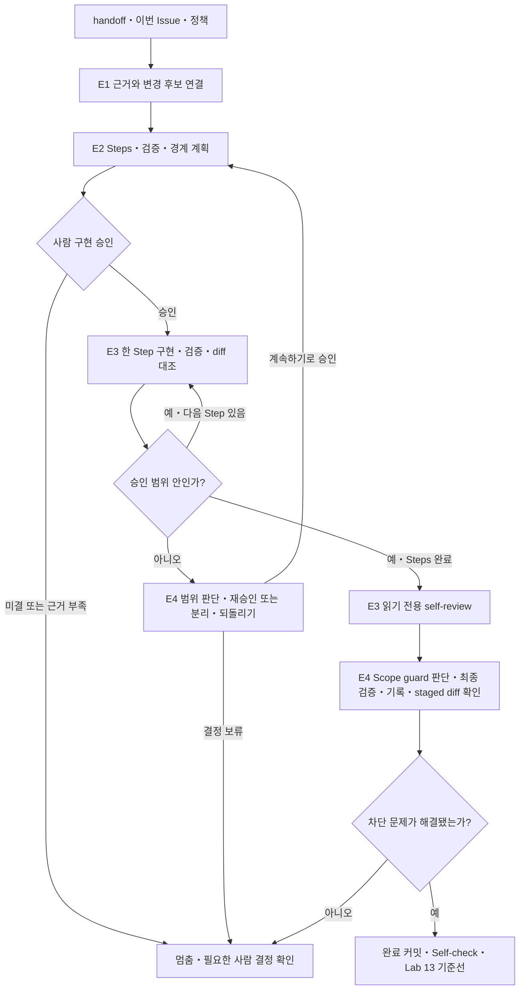

# Lab 12 — 다중 파일 변경: 계획에서 diff 확인까지

## 0. 이 랩이 끝나면

- Chapter 3을 시작하며, 처음으로 `src/`와 `tests/`를 변경합니다.
- 여러 파일의 변경을 상태 변화별로 계획하고 승인 단계와 diff를 대조하며, `notes/plans/l12-inventory-after-payment.md`와 `notes/diff-review-l12.md`를 남깁니다.
- 예상 소요 시간은 45분입니다.

Chapter 2에서 준비한 Issue·정책·plan·self-review를 처음 실제 코드 변경에 사용합니다. 이번 Lab의 중심은 **다중 파일 변경을 승인 가능한 작은 단계로 나누고 실제 diff·검증과 대조하는 것**입니다.

## 1. 시작 전 상태 확인

- `notes/session-handoff.md`의 **다음 세션의 첫 행동**과 남은 사람 결정을 확인합니다.
- handoff의 branch·HEAD·변경 파일을 현재 Git 상태와 대조합니다.
- root `AGENTS.md`, 위치 규약, 세 정책, plan template과 self-review prompt가 있어야 합니다.
- 이번 입력은 `labs/lecture12/inputs/l12-issue.md`입니다. E2 승인 전에는 `src/`와 `tests/`를 변경하지 않습니다.

시작할 때 현재 브랜치·HEAD·작업 트리를 확인하고, 기존 변경과 이번 Lab의 변경을 구분합니다.

이번 구현에 필요한 미결 상태·응답·실패 정보가 있으면 E2 승인 전에 사람이 결정합니다. 결정되지 않았다면 구현 완료로 표시하지 않습니다.

## 2. 실습 목표와 산출물

현재 코드와 목표를 구분합니다. 목표 동작은 제공 Issue의 Acceptance Criteria이며, 세부 판단은 정책 원문으로 확인합니다.

| 파일 | 현재 코드의 사실 | 이번 목표 또는 보존 경계 |
| --- | --- | --- |
| `src/orders.ts` | 생성 시 `product.stock -= item.quantity`; 재고 부족 검사 없음 | 부족 주문은 저장 전 거절, 생성만으로 재고 감소 없음 |
| `src/payments.ts` | 실패 시 시도 기록 뒤 `orders.delete(orderId)` | 성공 결제 뒤에만 재고 감소, 실패 주문과 시도 기록 보존 |
| `src/store.ts` | 상태는 `pending \| paid \| cancelled`; 실패 상태 없음 | 승인된 주문 정책에 맞는 실패 상태를 저장 가능하게 함 |
| `src/admin.ts` | `deriveDisplayStatus()`가 결제 시도 기록으로 표시 상태를 파생 | 이번 변경에서 수정하지 않음: Lab 18 VOC의 기준선 |

현재 테스트는 응답 형태 중심입니다. 이번에는 상태·재고·저장된 주문·시도 기록까지 확인합니다. 관리자 표시와 payments·admin의 기존 예외 fallback은 변경하지 않습니다.

| 단계 | 핵심 개념 | 핵심 작업 | 결과 |
| --- | --- | --- | --- |
| E1 | 요구사항과 근거의 연결 | Plan mode로 Issue를 분석하고 plan의 첫 세 영역을 저장 | 실제 구현 계획의 첫 세 영역 |
| E2 | 작은 변경 단위와 승인 경계 | Plan mode로 Steps·검증·경계를 검토한 뒤 저장하고 승인 | 범위와 무변경 증거를 갖춘 승인 기록 |
| E3 | 파일·동작·검증의 대조 | 승인 범위 구현, review pane의 diff 대조와 self-review | 코드·테스트와 diff review 초안 |
| E4 | Scope guard와 재승인 | 범위 판단, 검증 기록과 커밋 | 완성된 diff review와 완료 커밋 |
| Self-check | 완료 증거의 일치 | 누적 산출물과 앱 검사 확인 | Lab 12 완료 판정 |



정상 흐름은 E1 → E2 → E3 → E4입니다. 예상 밖 변경을 발견하면 다음 Step을 멈추고 E4에서 재승인·분리·되돌리기·보류를 판단합니다.

## 3. 실습

### E1. Issue를 계획으로 옮기기

#### 설계 질문

- 각 Acceptance Criteria가 어떤 정책·관찰 결과로 연결되며, handoff의 미결 중 무엇이 영향을 주나요?
- 먼저 읽을 파일과 변경 후보는 왜 다르며, 각 파일은 무엇을 책임지나요?

#### 판단 기준

- Goal은 Issue 완료 기준을 응답·상태·재고·이력처럼 관찰 가능한 결과로 바꿉니다.
- `Files to Read First`는 조사 근거, `Files to Change`는 승인받을 변경 후보입니다.
- 변경 후보마다 어떤 완료 기준과 정책 때문에 필요한지 설명할 수 있어야 합니다.
- 현재 코드와 목표 정책을 구분하고, 미결 항목은 임의로 채우지 않습니다.
- 계획 저장은 구현 승인이 아닙니다.

#### 실행

Composer에서 `/plan`으로 Plan mode에 들어간 뒤 아래 요청을 보냅니다. 이 단계에서는 자료를 읽고 제안만 받으며 파일을 수정하지 않습니다.

```text
다음 자료로 이번 구현 계획의 첫 세 영역을 제안해줘: @notes/session-handoff.md, @labs/lecture12/inputs/l12-issue.md, @docs/templates/implementation-plan.md
@docs/order-policy.md @docs/payment-policy.md @docs/inventory-policy.md와 현재 코드·테스트를 근거로 Goal, Files to Read First, Files to Change만 작성해라.
plan의 `Goal` 영역에는 Issue 완료 기준과 관찰 가능한 결과를 연결해라.
`Files to Read First`에는 정책·기존 테스트와 읽는 이유를,
`Files to Change`에는 파일별 변경 이유·책임을 적어라.
미결은 미결로 표시하고 파일은 수정하지 마라.
```

- Plan mode 종료 후 확인한 첫 세 영역을 `notes/plans/l12-inventory-after-payment.md`에 저장합니다. 나머지 다섯 영역은 template 안내만 유지합니다.
- 계획 저장만 허용하며 `src/`·`tests/`는 변경하지 않습니다. 구현 승인은 E2에서 별도로 진행합니다.

#### 검증

- [ ] Plan mode에서 파일 수정 없이 제안을 검토한 뒤, plan에 여덟 영역을 저장하고 첫 세 영역만 채웠는가?
- [ ] Goal이 Issue의 각 동작 완료 기준과 관찰 가능한 결과를 연결하고, 정책 근거와 미결을 구분하는가?
- [ ] 읽을 파일에 정책·현재 테스트와 이유가 있고, 변경 후보에서 완료 기준·조사 근거·파일 책임으로 돌아갈 수 있는가?
- [ ] handoff의 관련 미결 항목이 보이고, `src/`와 `tests/`는 그대로인가?

### E2. 구현 전 계획 승인받기

#### 설계 질문

- 주문 저장·재고 변경·결제 결과·주문 보존을 어떤 작은 상태 변화로 나눌까요?
- 각 단계의 종료 상태를 무엇으로 확인하며, 결제 직전 재고 소진과 미결 응답이 나타나면 어디서 멈출까요?
- 어떤 Steps·파일 목록·예상 변경 규모를 승인했는지 나중에 diff와 대조할 수 있나요?

#### 판단 기준

파일별 순서가 아니라 사람이 한 번에 검토할 수 있는 상태 변화로 Step을 나눕니다.


- 각 Step에 입력 근거·허용된 변경·예상 수정 범위·종료 상태·확인 방법을 둡니다.
- Tests는 Step의 종료 상태에 직접 연결하고 실행 방법과 기대 증거를 적습니다.
- 생성 전 검사와 결제 직전 재검사, 동일 품목 합산과 전체 품목 일괄 처리를 계획에 반영합니다.
- 구현에 필요한 상태·이력·응답이 미결이면 사람이 결정하기 전 승인하지 않습니다.
- 승인한 Steps·파일·예상 범위와 승인 전 앱 무변경 증거를 Approval Gate에 남깁니다.

#### 실행

다시 `/plan`으로 Plan mode에 들어가 저장된 plan의 나머지 영역을 제안받습니다. 필요한 결정은 사람이 답하며, 답을 받기 전에는 구현 가능한 계획으로 간주하지 않습니다.

```text
@notes/plans/l12-inventory-after-payment.md에 작성할 Steps, Tests to Add or Update, Risks, Out of Scope, Stop Conditions를 제안해줘. Steps는 상태 변화별 입력 근거·허용된 변경·종료 상태·확인 방법을, Tests to Add or Update는 각 Step의 검증 대상·명령·기대 증거를 적어라.
Risks에는 영향·감지 방법, Steps에는 예상 수정 범위, Out of Scope에는 Issue의 제외 항목·deriveDisplayStatus() 미변경·Lab 15에서 다룰 payments와 admin의 예외 fallback 제거를 적어라.
결제 직전 재고 부족의 미결 동작은 사람 결정과 Stop Conditions로 남기고 임의 확정하지 마라.
성공·반복 한도·정체·사람 판단과 Approval Gate의 승인 대기 조건을 제안하고, 예상 밖 파일 수·diff 규모 증가 시 다음 Step 전에 멈추는 조건을 적어라. 필요한 결정을 묻고 멈춰라. 파일은 수정하지 마라.
```

- Plan mode 종료 후 확인한 나머지 다섯 영역을 같은 plan에 저장합니다. 미결과 구현 승인 대기를 유지하며 `src/`·`tests/`는 변경하지 않습니다.
- 저장된 전체 plan과 승인 전 앱 코드·테스트 무변경 상태를 확인한 뒤 구현 승인 여부를 판단합니다.

코드에 필요한 미결이 남으면 승인하지 않습니다. 실제 승인 후 승인한 Steps·Files to Change 범위, 승인 근거와 무변경 확인 결과를 plan의 Approval Gate에 기록합니다. 구현은 E3에서 시작하며, 반복 한도도 사람이 승인한 값만 사용합니다.

#### 검증

- [ ] Plan mode에서 검토한 나머지 다섯 영역이 저장되고 Steps가 상태 변화별 근거·예상 수정 범위·종료 상태·확인 방법을 갖는가?
- [ ] 각 Step에 직접 연결된 테스트·명령·기대 증거와 Risks의 영향·감지 방법이 있는가?
- [ ] Out of Scope에 관리자 표시 교정·외부 결제사·DB와 `deriveDisplayStatus()` 미변경·Lab 15의 예외 fallback 제거 보류가 있는가?
- [ ] 결제 직전 부족의 미결 동작이 정지 조건에 있고, 관련 결정 없이 구현을 승인하지 않았는가?
- [ ] 승인한 Steps·파일 목록·예상 수정 범위·사람 승인 근거와 승인 전 앱 코드·테스트 무변경 증거가 같은 자리에 있는가?

### E3. 구현하고 계획과 diff 대조하기

#### 설계 질문

- 각 Step 뒤 변경 파일과 diff 규모가 승인 범위에 맞고, 각 변경을 Step에 연결할 수 있나요?
- 테스트는 `ok` 필드 존재가 아니라 재고·주문 상태·보존 이력을 확인하나요?
- self-review가 요약과 범위 이탈·누락 테스트를 구분하나요?

#### 판단 기준

| 검토 축 | 비교 대상 | 찾으려는 문제 |
| --- | --- | --- |
| 파일 범위 | 실제 변경 파일 ↔ Files to Change | 계획 밖 파일, 필요한 후보의 미변경, 새 파일 누락 |
| 동작 범위 | 변경된 코드 ↔ Steps·적용 정책 | 같은 파일 안의 계획 밖 동작, 제외 범위 변경, 예상 밖 재작성 |
| 검증 연결 | 변경 동작 ↔ Tests·실제 검증 결과 | 실행되지 않은 검증, 종료 상태를 확인하지 않는 assertion |

- 파일 이름뿐 아니라 변경된 분기·호출·저장 순서를 승인된 Steps와 대조합니다.
- 거부·실패 시 바뀌면 안 되는 상태·재고·이력도 확인합니다.
- 테스트는 응답 필드 존재가 아니라 승인된 관찰 결과를 assertion해야 합니다.
- self-review에는 Issue·승인 plan·전체 diff·실제 검증 결과를 제공합니다.
- 사람의 diff 검토, self-review, test·lint·typecheck는 서로 대신하지 않습니다.

#### 실행

```text
@notes/plans/l12-inventory-after-payment.md의 사람 승인 기록을 확인하고 승인된 범위만 구현해줘. 각 Step의 상태 변화와 검증을 따라 필요한 테스트를 추가·수정해라.
deriveDisplayStatus()와 관리자 표시 계산, payments·admin의 예상 밖 예외 fallback은 수정하지 마라. 정상적으로 판정된 결제 실패 분기 개선과 예외 fallback 제거를 구분해라.
각 Step의 구현·검증 뒤 전체 작업 diff를 승인 계획과 대조해라. 파일 수나 diff 규모가 예상 밖으로 커지면 다음 Step 전에 멈추고 계획 수정·작업 분리·불필요한 변경 되돌리기를 사람에게 요청해라.
미결 정책·계획 밖 변경이 필요하면 멈추고 사람에게 확인해라. 실행한 검증과 미실행 검증, 실제 결과를 구분해 보고하고 아직 stage나 commit하지 마라.
```

#### 수행 순서

1. 각 Step 뒤 review pane의 **Unstaged 전체 diff**로 계획과 실제 변경을 대조합니다.
2. 예상 밖 파일·동작·규모 확대가 있으면 다음 Step 전에 멈춥니다.
3. `docs/prompts/self-review.md`로 Issue·승인 plan·전체 `src`·`tests` diff·실제 검증 결과를 읽기 전용으로 검토합니다.
4. 결과를 `notes/diff-review-l12.md`에 기록합니다.

`notes/diff-review-l12.md`에는 `변경 파일 대조`, `Steps 대조`, `Self-review 결과`, `Scope guard 판단`, `검증 결과` H2를 둡니다. 판단 전 항목은 보류로 남기며, 검토 중에는 앱 코드를 수정하거나 **Stage all / Revert all**을 사용하지 않습니다.

#### 검증

- [ ] 부족 주문 미저장과 생성 시 재고 불변을 응답·저장소 assertion으로 확인했는가?
- [ ] 성공 결제의 정확한 한 번 차감, 실패 상태·주문·시도 기록 보존을 검증했는가?
- [ ] review pane의 전체 작업 diff를 파일·Step별로 대조하고, `deriveDisplayStatus()`·기존 예외 fallback 미변경과 발견한 줄의 댓글 근거를 확인했는가? 발견이 없으면 없음을 기록했는가?
- [ ] Step별 파일 수·diff 규모 대조가 기록되고, 예상 밖 확대가 있으면 다음 Step 전에 멈추고 사람 판단을 요청했는가?
- [ ] self-review에 네 입력이 제공됐고 범위 이탈·누락 테스트·요약·입력 한계가 분리됐는가?
- [ ] diff review의 다섯 영역이 있고, 미결 또는 검증하지 않은 동작을 완료로 표시하지 않았는가?

### E4. Scope guard와 검증 기록

#### 설계 질문

- 계획 밖 변경과 규모 확대는 완료 기준에 필요하고 정책·제외 범위에 맞나요? 계획 재승인·작업 분리·되돌리기 중 무엇을 고를까요?
- 실패·미실행 검증과 남은 위험을 커밋 전에 어떻게 드러낼까요?

#### 판단 기준

파일 수·diff 크기는 검토 신호입니다. 예상 밖 변경은 완료 기준 필요성·정책 근거·제외 범위·검토 가능한 규모로 판단합니다.

| 확인한 차이 | 다음 행동 후보 | 계속하기 전에 필요한 것 |
| --- | --- | --- |
| 완료 기준에 필요하고 정책·제외 범위에 맞으며 검토 가능한 변경 | 계획 수정·재승인 | 변경 파일·Steps·영향·Tests를 갱신하고 사람 승인 |
| 필요한 변경이지만 너무 크거나 독립 작업이 섞임 | 작업 분리 | 완료 기준·검증·승인 단위로 나눈 범위를 사람 확인 |
| 불필요하거나 Issue의 Out of Scope를 건드림 | 이번 변경만 되돌리기 | 제거 범위를 사람 승인하고 기존 작업 보존 |
| 정책 미결·충돌 또는 필요성 근거 부족 | 보류·사람 결정 요청 | 정책·범위 결정 근거 확인; plan 수정만으로 정책 확정 금지 |

- 차이가 없다면 `없음`과 대조 근거를 남깁니다.
- 계획을 실제 변경에 맞춰 사후 승인하거나 테스트 때문에 정책을 바꾸지 않습니다.
- 실행·실패·미실행 검증을 구분하고, 수정 뒤에는 영향을 받는 검증을 다시 실행합니다.
- 승인한 변경·검토 기록·최종 검증·staged diff가 같은 코드 상태를 설명해야 합니다.

#### 실행

```bash
npm test
npm run lint
npm run typecheck
```

```text
@notes/diff-review-l12.md의 `## Scope guard 판단`과 검증 결과를 완성해줘. 계획 밖 변경·예상 밖 파일 수와 diff 확대를 모두 적고 완료 기준 필요성·제외 범위·정책 근거·검토 가능한 규모로 계획 재승인·작업 분리·구현 되돌리기 후보를 판단해라.
사람 승인 없이 계획을 사후 확정하거나 앱 코드·정책을 수정하지 마라.
npm test, npm run lint, npm run typecheck의 실행 명령·실제 결과·기대 증거와 미실행 이유를 구분하고, 남은 실패·보류와 deriveDisplayStatus()의 관찰 위험도 기록해라.
```

사람이 Scope guard 조치를 승인한 경우에만 필요한 수정·재승인·검증을 수행합니다. 필수 검증이나 승인 문제가 남으면 완료 커밋을 보류합니다. 모두 해결한 뒤 승인된 코드·테스트와 plan·diff review만 stage하고, staged diff에 다른 변경이 없는지 확인합니다.

```bash
git add -- src tests notes/plans/l12-inventory-after-payment.md notes/diff-review-l12.md
git diff --cached --stat
git diff --cached
git commit -m "fix: apply inventory after successful payment"
```

#### 검증

- [ ] 계획 밖 변경·규모 확대마다 판단 기준과 계획 재승인·작업 분리·되돌리기·보류 조치가 기록됐는가?
- [ ] 필요한 사람 재승인과 검증을 마쳤고 정책·`deriveDisplayStatus()`·기존 예외 fallback과 Issue의 제외 범위를 보존했는가?
- [ ] 세 검증 명령의 결과가 최종 변경 상태의 실제 증거와 연결되고 실패·미실행도 숨기지 않았는가?
- [ ] staged diff와 커밋 범위가 승인된 코드·테스트·plan·diff review에 한정됐는가?

## 4. Self-check

```bash
node labs/tools/check.mjs 12
```

검사기는 누적 필수 산출물을 확인하며, Lab 12의 `runAppChecks: true`로 test·lint·typecheck도 실행합니다. 이미 E4에서 실행했어도 최종 상태를 재검사합니다. 형식 PASS가 계획 승인이나 정책 정합을 보증하지는 않습니다. 커밋 뒤 비어 있는 diff는 완료 증거가 아니므로 마지막 커밋과 diff review도 확인합니다.

- [ ] 필수 plan과 diff review가 있고 누적 산출물·앱 검사가 모두 통과했는가?
- [ ] commit·status·diff review가 같은 상태를 설명하며 미결 동작을 완료로 처리하지 않았는가?
- [ ] E1~E4를 45분 안에 마쳤거나, 중단 이유와 남은 사람 판단을 사실대로 기록했는가?

## 5. 자주 하는 실수

- 승인 전에 작은 코드 변경을 먼저 시작하거나 stage해서 무변경 diff처럼 보이게 합니다.
- 세 파일을 한 번에 고치거나 예상 밖 diff 확대에도 계속 구현해 원인과 검토 범위를 놓칩니다.
- 실패 주문 보존과 함께 `deriveDisplayStatus()`를 고쳐 Lab 18 VOC의 원인을 없앱니다.
- 테스트 실패를 맞추려고 정책을 바꿉니다.
- Issue 완료 기준에 없는 동작을 좋아 보인다는 이유로 추가하거나 미결 응답을 임의 확정합니다.
- diff를 파일 단위로만 보고 Steps와 대조하지 않습니다.
- 실패한 검증을 기록에서 빼거나 실행하지 않은 검증을 통과로 씁니다.

## 6. 다음 lab으로 넘기는 것

Lab 13에는 이 코드 상태와 승인 plan·diff review·검증 기록을 넘깁니다. 이것이 환각 패치를 식별하는 기준선입니다. `deriveDisplayStatus()`의 실패 이력 기반 표시 위험은 관찰 대상으로 남기고, payments·admin의 기존 예외 fallback은 Lab 15에서 제거할 기준선으로 유지합니다. 정책과 아직 다른 부분도 구현 완료와 구분해 기록합니다.

Lab 12는 계획 → 승인 → 작은 구현 → diff·검증 → 범위 판단의 첫 실사용 루프입니다. 이후 Lab 14에서 assertion을 심화하고, Lab 15에서 silent fallback을 제거하며, Lab 16에서 PR preflight로 확장합니다. 역할 분리·GitHub Issue·Automation은 뒤 강의에 연결합니다. 이번 Lab의 검증 통과를 이 후속 작업까지 완료한 것으로 보고하지 않습니다.

## 7. 참고

- [Build iterative repair loops with Codex](https://developers.openai.com/cookbook/examples/codex/build_iterative_repair_loops_with_codex) — 검토·수정·검증을 분리하고 실제 검증 피드백을 다음 판단의 근거로 사용합니다.
- [Slash commands](https://learn.chatgpt.com/docs/reference/slash-commands), [Code review](https://learn.chatgpt.com/docs/code-review) — Plan mode 진입, review pane의 범위 선택과 줄 단위 댓글 사용법을 확인합니다.
