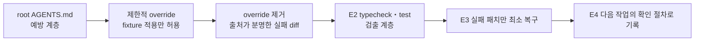

# Lab 13 — 환각 차단

## 0. 이 랩이 끝나면

- 존재하지 않는 내부 API를 사용하는 통제된 실패 패치를 작업 트리에 재현합니다.
- typecheck와 test가 서로 다른 검증 증거를 만든다는 것을 실제 출력으로 구분합니다.
- 주입한 패치만 최소 복구해 `src/`와 `tests/`를 Lab 12 상태로 되돌립니다.
- `notes/error-log-l13.md`, `docs/checklists/hallucination-guard.md`를 남깁니다.

Lab 04~11에서 만든 root `AGENTS.md`와 기준 문서는 변경 전에 근거와 승인 범위를 확인하는 **예방 계층**입니다. 안전한 모델은 승인된 계획 없이 앱 파일을 바꾸지 않으므로 라이브 환각은 수업 입력으로 재현성이 낮습니다. 이번 Lab은 원본 지침을 수정하지 않고, fixture 적용 단계에만 제한적 `AGENTS.override.md`를 사용합니다. 출처가 명확한 실패 패치를 **통제된 fault injection**으로 적용한 뒤 override를 제거하고, 정상 지침 아래에서 typecheck·test와 최소 복구 절차를 확인합니다.

## 1. 시작 전 상태 확인

- Lab 12 코드·테스트·plan·diff review와 검증 기록이 커밋돼 있어야 합니다.
- 시작 작업 트리가 깨끗해야 하며 E1 실패 패치는 커밋하지 않습니다. root `AGENTS.md`도 수정하지 않습니다.
- `labs/fixtures/l13-hallucinated-patch.md`는 모델 성능을 평가하는 답안이 아니라 검출·복구를 연습하는 통제된 오류 입력입니다.
- 이전 실행의 `AGENTS.override.md`가 남아 있으면 제거하고 시작합니다.

```bash
git status --short --branch
git log --oneline -3 -- src tests
git diff --stat -- src tests
```

현재 branch와 `src`·`tests`의 최근 기준 커밋을 확인하고 앱 diff가 없는지 봅니다. 기준선이 깨끗해야 E1에서 보이는 앱 diff를 통제 입력의 결과로 판정할 수 있습니다.

## 2. 실습 목표와 산출물

| 단계 | 핵심 개념 | 핵심 작업 | 결과 |
| --- | --- | --- | --- |
| E1 | 통제된 fault injection | 제한적 override에서 fixture를 그대로 적용하고 원래 지침으로 복귀 | 커밋하지 않은 실패 패치 |
| E2 | 검출 계층의 차이 | typecheck와 test 결과를 원문으로 기록 | `notes/error-log-l13.md` |
| E3 | 최소 복구 | E1 패치만 제거하고 전후 검증 연결 | Lab 12와 같은 `src`·`tests` |
| E4 | 실패를 재사용 기준으로 전환 | `AGENTS.md`와 겹치지 않는 guard 작성·커밋 | `docs/checklists/hallucination-guard.md` |



## 3. 실습

### E1. 통제된 실패 패치 주입하기

#### 설계 질문

- 예방 계층과 검출 계층은 각각 어느 시점의 오류를 다루나요?
- 왜 라이브 모델의 실수 대신 출처가 분명한 fixture를 사용하나요?
- 왜 원본 `AGENTS.md`를 고치지 않고 제한적 override를 사용하나요?
- 패치를 적용하기 전에 어떤 존재 주장을 원문 코드에서 확인해야 하나요?

#### 판단 기준

이 실습은 “Codex가 방금 환각했다”는 것을 증명하지 않습니다. fixture는 **존재하지 않는 메서드·옵션·비동기 계약을 실제로 있다고 가정한 패치가 작업 트리에 들어온 상황**을 동일하게 재현합니다. 평가 대상은 모델이 아니라 그 패치를 발견하고 원래 기준선으로 복구하는 workflow입니다.

| 계층 | 이번 Lab의 역할 | 정상 상태 |
| --- | --- | --- |
| root `AGENTS.md` | 읽기 순서·정책·계획 승인을 먼저 확인하는 예방 계층 | 보존 |
| 임시 `AGENTS.override.md` | fixture 한 건의 적용만 허용 | E2 전에 삭제 |
| fixture | 이미 들어온 잘못된 코드를 반복 가능하게 재현하는 통제 입력 | E1에서만 적용 |
| typecheck·test | 작업 트리에 들어온 오류를 발견하는 검출 계층 | E2에서 실행 |

| 주장 | 존재를 판정할 근거 | 모델 설명만으로 충분한가? |
| --- | --- | --- |
| 외부 패키지가 설치돼 있음 | `package.json`, lockfile, 실제 module resolution | 아니오 |
| 내부 helper나 메서드가 있음 | 선언·export·호출부의 코드 검색 | 아니오 |
| 인자·옵션을 받을 수 있음 | 타입 선언과 구현 signature | 아니오 |
| 변경이 동작함 | typecheck·test와 관찰 가능한 결과 | 아니오 |

fixture에 적힌 이름이 그럴듯해도 존재 근거가 되지 않습니다. 적용 전에 현재 저장 계층의 선언·export·호출부에서 메서드와 signature를 찾고, 적용 뒤에는 diff가 fixture와 같은지 확인합니다.

#### 실행

1. root `AGENTS.md`에서 변경 전 확인이 잘못된 패치를 어떻게 예방하는지 확인합니다. 원본 파일은 수정하지 않습니다.

2. fixture 적용 단계에서만 `labs/lecture13/inputs/l13-AGENTS.override.md`의 제한적 지침을 사용합니다. 원본 root `AGENTS.md`는 수정하지 않으며, fixture 적용 뒤 정상 지침으로 돌아옵니다.

3. `labs/fixtures/l13-hallucinated-patch.md`와 현재 `src/payments.ts`, 저장 계층을 대조해 메서드·옵션·비동기 계약의 존재 여부를 확인한 뒤, fixture의 diff 블록만 현재 문맥에 그대로 적용합니다.

```text
@labs/fixtures/l13-hallucinated-patch.md 파일의 diff 블록을 통제된 오류로 현재 src/payments.ts에 그대로 적용해줘. 오류를 보정하거나 검증·stage·commit하지 마라.
```

4. fixture 적용이 끝나면 임시 override를 제거합니다. Review pane에서 fixture와 같은 `src/payments.ts` diff만 있는지 확인하고, 다른 앱 파일, dependency·lockfile, staged diff가 바뀌었다면 E2 전에 제거합니다.

#### 검증

- [ ] fixture를 라이브 모델의 환각이 아니라 통제된 오류 입력으로 설명했는가?
- [ ] root `AGENTS.md`는 그대로이고 임시 override는 fixture 적용만 허용했는가?
- [ ] 적용 전에 메서드·옵션·비동기 계약의 존재 여부를 현재 코드에서 확인했는가?
- [ ] fixture와 같은 `src/payments.ts` diff만 작업 트리에 있는가?
- [ ] override를 삭제했고 dependency·lockfile과 다른 앱 파일은 그대로인가?
- [ ] 검증·stage·commit 없이 E2로 넘길 실패 패치 하나만 남겼는가?

### E2. 검증 계층별로 실패 기록하기

#### 설계 질문

- typecheck는 코드를 실행하지 않고 무엇을 발견하나요?
- test는 타입이 맞는 코드에서도 어떤 동작 실패를 보여주나요?
- 같은 패치가 두 명령에서 서로 다른 실패 원문을 만들 수 있는 이유는 무엇인가요?

#### 판단 기준

| 확인 수단 | 잡는 문제 | 이것만으로 보증하지 못하는 것 |
| --- | --- | --- |
| `npm run typecheck` | 없는 모듈·메서드·속성, signature 불일치 | 실제 실행 결과 |
| `npm test` | 실행 시 오류, 기대한 상태·응답·저장 결과의 불일치 | assertion이 없는 동작 |

같은 패치가 두 명령에서 모두 실패하거나 한 명령이 먼저 멈출 수 있습니다. 결과를 예상해서 맞추지 말고 실제 출력에서 각 검증이 멈춘 지점을 기록합니다. 정책·업무 의미 검토는 Lab 12에서 다뤘으며 이번 실습의 판정 대상은 아닙니다.

`notes/error-log-l13.md`는 명령별로 실행 명령, 종료 코드, 첫 관련 에러의 원문, 파일과 위치를 둡니다. 에러를 요약문으로 바꾸지 않습니다. 원문이어야 컴파일러·테스트 러너의 오류 종류와 식별자·위치를 다음 사람이 다시 확인할 수 있습니다.

#### 실행

```text
현재 통제된 실패 패치를 수정하지 말고 npm run typecheck와 npm test를 직접 실행해줘. 각 명령의 실행 여부와 종료 코드, 첫 관련 에러 원문, 파일과 위치를 구분해 notes/error-log-l13.md에 기록하고 두 검증이 잡은 문제의 차이를 적어라. 실행하지 못한 명령은 그 이유를 기록하고 패치 수정·stage·commit은 하지 마라.
```

#### 검증

- [ ] 두 명령의 실행 여부와 실제 종료 코드가 각각 기록됐는가?
- [ ] 첫 관련 에러가 요약이 아니라 원문 그대로 보존됐는가?
- [ ] 에러의 파일·위치와 존재하지 않는 참조가 연결됐는가?
- [ ] typecheck와 test의 검출 범위를 실제 출력에 근거해 구분했는가?

### E3. 실패 패치만 최소 복구하기

#### 설계 질문

- 존재하지 않는 함수를 새로 만드는 것과 근거 없는 호출을 제거하는 것 중 어느 쪽이 기준 상태를 복구하나요?
- Lab 12의 정상 변경을 유지하면서 E1 diff만 제거했음을 어떻게 증명하나요?

#### 판단 기준

| 복구 대상 | 유지할 대상 | 금지할 대응 |
| --- | --- | --- |
| E1에서 주입한 호출·옵션 | 시작 HEAD의 Lab 12 코드와 테스트 | 가짜 API를 새로 구현해 패치를 살림 |
| 실패 패치 때문에 생긴 앱 diff | E2의 실패 원문과 실행 기록 | 앱 전체 되돌리기, 다른 변경 삭제 |

복구 뒤 `git diff --stat -- src tests`가 시작할 때와 같아야 합니다. 시작 상태가 깨끗했다면 출력이 비어 있는 것이 Lab 12 기준선 복구의 증거입니다.

#### 실행

```text
@notes/error-log-l13.md와 현재 src·tests diff를 사용해 E1에서 주입한 실패 패치만 제거해줘. 존재하지 않는 함수나 패키지를 새로 만들어 살리지 말고 Lab 12의 기존 변경은 유지해라. 복구 뒤 typecheck와 test를 다시 실행하고 전후 결과를 error log에 연결해라. stage·commit하지 마라.
```

```bash
git diff --stat -- src tests
git diff -- src tests
```

#### 검증

- [ ] E1에서 주입한 호출·옵션만 제거되고 Lab 12의 코드·테스트가 유지됐는가?
- [ ] 존재하지 않는 API를 새로 구현하거나 패키지를 설치하지 않았는가?
- [ ] typecheck와 test의 복구 전후 결과가 error log에 연결됐는가?
- [ ] `src/`·`tests/` diff가 시작 상태와 같고 환각 패치를 커밋하지 않았는가?

### E4. 실패 경험을 Hallucination guard로 남기기

#### 설계 질문

- `AGENTS.md`의 변경 전 읽기 순서와 재사용 체크리스트는 무엇이 겹치고 무엇이 다른가요?
- 이번 실패에서 다음 작업에도 반복해서 확인할 기준은 무엇인가요?

#### 판단 기준

| 문서 | 책임 | 겹치는 지점 | 다른 지점 |
| --- | --- | --- | --- |
| root `AGENTS.md` | 이 저장소에서 무엇을 먼저 읽고 언제 멈출지 routing | 코드·패키지·테스트 원문 확인 | 프로젝트별 정책·계획·검증 진입점 |
| hallucination guard | 존재 주장과 검증 증거를 점검하는 재사용 기준 | 확인하지 않은 가정을 변경에 넣지 않음 | 외부 API·내부 helper·CLI 옵션의 존재 검증 절차 |

새 문서에 `AGENTS.md` 전문을 복제하지 않습니다. E1~E3에서 실제로 관찰한 실패와 복구 근거를 일반화합니다. 최소 다섯 항목을 두되 코드·패키지의 실제 존재 확인, 실행 검증, 확인하지 못한 내용을 `확인 필요`로 표시하는 규칙을 분리합니다. 각 항목에는 확인한 위치(파일 경로나 명령)를 적을 자리를 두고, 위치가 비어 있으면 아직 근거가 없다는 뜻이므로 `확인 필요`로 표시합니다.

#### 실행

```text
@notes/error-log-l13.md와 root @AGENTS.md를 대조해 docs/checklists/hallucination-guard.md를 작성해줘. AGENTS.md의 읽기 순서를 복제하지 말고, 코드·패키지의 실제 존재 확인, type·signature 확인, 실행 검증, 에러 원문 보존, 확인하지 못한 내용의 `확인 필요` 표시를 분리한 체크 항목을 다섯 개 이상 둬라. 각 항목에는 확인한 위치를 적을 자리를 두고 확인하지 못한 항목은 `확인 필요`로 표시해라. 앱 코드는 수정하지 마라.
```

`notes/error-log-l13.md`와 `docs/checklists/hallucination-guard.md` 두 산출물만 stage하고, staged diff에 `src/`·`tests/`가 없을 때만 커밋합니다.

#### 검증

- [ ] 체크리스트가 실제 실패에서 일반화한 판정 가능한 항목을 다섯 개 이상 갖는가?
- [ ] 코드·패키지 존재 확인과 type·signature 확인이 구분됐는가?
- [ ] 실행 검증과 `확인 필요` 표시 규칙이 별도 항목인가?
- [ ] 각 항목이 확인 위치 또는 `확인 필요` 중 하나를 갖는가?
- [ ] `AGENTS.md` 전문을 복제하지 않고 책임 차이를 유지했는가?
- [ ] 커밋에 두 문서만 있고 `src/`·`tests/` 순변경은 없는가?

## 4. Self-check

```bash
node labs/tools/check.mjs 13
git show --stat --oneline HEAD
git diff HEAD^ HEAD -- src tests
```

검사기는 두 산출물, 체크리스트 항목 수와 앱 test·lint·typecheck를 확인합니다. 마지막 diff가 비어 있어야 Lab 13 커밋이 Lab 12 앱 기준선을 바꾸지 않았다고 판정할 수 있습니다.

- [ ] 필수 산출물과 앱 검사가 통과했는가?
- [ ] error log의 실패·복구 기록과 guard 항목이 연결되는가?
- [ ] Lab 13 커밋의 `src/`·`tests/` 순변경이 없는가?

## 5. 자주 하는 실수

- 존재 여부를 확인하지 않거나, 없는 함수·패키지를 새로 만들어 실패 패치를 살립니다.
- fixture 패치를 라이브 환각이라고 설명하거나 임시 override를 삭제하지 않습니다.
- typecheck·test의 종료 코드와 에러 원문을 요약으로 바꿔 검출 근거를 잃습니다.
- 실패 패치와 함께 Lab 12 변경까지 되돌리거나 `AGENTS.md` 전문을 체크리스트에 복제합니다.

## 6. 다음 lab으로 넘기는 것

Lab 14의 시작 조건은 **Lab 13 종료 시 `src/`와 `tests/`가 Lab 12와 같은 상태인 것**입니다. `notes/error-log-l13.md`는 실패와 복구의 작업 기록으로, `docs/checklists/hallucination-guard.md`는 테스트 보강 전에 존재 주장을 확인하는 장기 기준으로 넘깁니다.

E1의 fixture 패치는 Lab 13 산출물이 아닙니다. Lab 14로 넘어가기 전에 제거되어 `src/`와 `tests/`가 Lab 12 기준선과 같아야 합니다.

임시 `AGENTS.override.md`도 산출물이 아닙니다. E2 전에 삭제해 root `AGENTS.md`의 정상 예방 계층으로 돌아옵니다.
