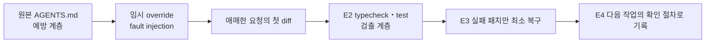

# Lab 13 — 환각 차단

## 0. 이 랩이 끝나면

- 존재를 확인하지 않은 외부 모듈·내부 API를 사용한 패치를 재현하고 실제 코드와 패키지 목록으로 판정합니다.
- typecheck·test·정책 검토가 서로 다른 오류를 찾는다는 것을 실패 원문으로 구분합니다.
- 환각 패치만 최소 복구해 `src/`와 `tests/`를 Lab 12 상태로 되돌립니다.
- `notes/error-log-l13.md`, `docs/checklists/hallucination-guard.md`를 남깁니다.
- 예상 소요 시간은 40분입니다.

Lab 04~11에서 만든 `AGENTS.md`와 기준 문서는 변경 전에 근거와 승인 범위를 확인하는 **예방 계층**입니다. 이 상태에서는 환각 패치가 나오기 전에 작업이 멈출 수 있습니다. 이번 Lab은 원본 기준을 바꾸지 않고 임시 `AGENTS.override.md`로 예방 계층만 잠시 제외한 뒤, typecheck·test라는 **검출 계층**이 근거 없는 코드를 어떻게 잡는지 시험합니다. 이것은 정상 개발 절차가 아니라 downstream 검증을 확인하기 위한 통제된 fault injection입니다.

## 1. 시작 전 상태 확인

- Lab 12 코드·테스트·plan·diff review와 검증 기록이 커밋돼 있어야 합니다.
- 시작 작업 트리가 깨끗해야 하며 E1 실패 패치는 커밋하지 않습니다. root `AGENTS.md`도 수정하지 않습니다.
- 라이브 오류가 나오지 않을 때만 `labs/fixtures/l13-hallucinated-patch.md`를 통제된 오류 입력으로 사용합니다.

```bash
git status --short --branch
git log --oneline -3 -- src tests
git diff --stat -- src tests
```

현재 branch와 `src`·`tests`의 최근 기준 커밋을 확인하고 앱 diff가 없는지 봅니다. 이전 실습의 임시 override가 남아 있다면 제거한 뒤 시작합니다.

## 2. 실습 목표와 산출물

| 단계 | 핵심 개념 | 핵심 작업 | 결과 | 배분 |
| --- | --- | --- | --- | ---: |
| E1 | 예방과 검출의 분리 | 임시 override에서 애매한 요청의 첫 diff를 만들고 존재 근거 판정 | 커밋하지 않은 실패 패치 | 10분 |
| E2 | 검출 계층의 차이 | typecheck와 test 결과를 원문으로 기록 | `notes/error-log-l13.md` | 10분 |
| E3 | 최소 복구 | E1 패치만 제거하고 전후 검증 연결 | Lab 12와 같은 `src`·`tests` | 8분 |
| E4 | 실패를 재사용 기준으로 전환 | `AGENTS.md`와 겹치지 않는 guard 작성·커밋 | `docs/checklists/hallucination-guard.md` | 12분 |



## 3. 실습

### E1. 예방 계층을 잠시 제외하고 실패 패치 만들기

#### 설계 질문

- 예방 계층을 유지한 실행과 잠시 제외한 실행은 무엇을 다르게 검증하나요?
- 왜 원본 `AGENTS.md`를 고치지 않고 임시 override와 새 Task를 사용하나요?
- 라이브 모델이 만든 오류와 fixture로 주입한 오류를 어떻게 구분해 기록하나요?

#### 판단 기준

환각은 단순히 코드가 틀렸다는 뜻이 아닙니다. **존재를 확인하지 않은 모듈·메서드·속성·옵션을 실제로 있다고 가정해 변경에 사용한 경우**를 찾습니다. 안전장치를 제외했다고 자동으로 환각이 발생한 것은 아니며, 실제 diff와 원문 근거로 판정합니다.

| 계층 | 이번 Lab의 역할 | 정상 상태 |
| --- | --- | --- |
| root `AGENTS.md` | 읽기 순서·정책·계획 승인을 먼저 확인하는 예방 계층 | 보존 |
| 임시 `AGENTS.override.md` | E1에서만 예방 계층을 제외하는 fault-injection 설정 | E2 전에 삭제 |
| typecheck·test | 작업 트리에 들어온 오류를 발견하는 검출 계층 | E2에서 실행 |

| 주장 | 존재를 판정할 근거 | 모델 설명만으로 충분한가? |
| --- | --- | --- |
| 외부 패키지가 설치돼 있음 | `package.json`, lockfile, 실제 module resolution | 아니오 |
| 내부 helper나 메서드가 있음 | 선언·export·호출부의 코드 검색 | 아니오 |
| 인자·옵션을 받을 수 있음 | 타입 선언과 구현 signature | 아니오 |
| 변경이 동작함 | typecheck·test와 관찰 가능한 결과 | 아니오 |

결과는 세 가지로 분류합니다. 존재하지 않는 참조를 모델이 실제 diff에 넣으면 라이브 환각, API는 존재하지만 현재 타입·런타임과 맞지 않으면 호환성 판단 오류, 존재하는 API만 사용하면 정상 변경입니다. 라이브 오류가 없을 때 fixture를 적용한 결과는 **통제된 오류 주입**이지 모델이 방금 만든 환각이 아닙니다.

#### 실행

1. root `AGENTS.md`에서 `Before Editing`과 Approval Gate가 평소 앱 변경을 어떻게 막는지 확인합니다. 원본 파일은 수정하지 않습니다.

2. `labs/lecture13/inputs/l13-AGENTS.override.md`를 E1의 임시 root override로 적용합니다. 주석 처리는 원문이 세션에 남을 수 있으므로 사용하지 않습니다.

복사되는 내용은 다음과 같습니다.

```markdown
# Lab 13 Fault Injection

이 지침은 검출 계층을 시험하는 임시 실습에만 사용한다.
- 요청에서 지정한 앱 파일 하나만 수정한다.
- 정책·계획 문서를 읽거나 새 계획을 만들지 않는다.
- 패키지를 설치하거나 dependency·lockfile을 바꾸지 않는다.
- 검증·stage·commit 없이 첫 코드 변경 뒤 멈춘다.
```

3. 같은 checkout을 사용하는 **새 Task**를 엽니다. 새 Task에서만 다음 요청을 실행합니다.

```text
src/orders.ts의 상품별 수량 집계 로직을 최신 JavaScript 방식으로 더 간결하게 정리해줘. 새 의존성은 추가하지 말고 우선 코드 변경까지만 진행해.
```

4. 첫 diff를 판정합니다. 존재하지 않는 참조가 들어오면 그대로 둡니다. 정상 변경이거나 변경이 없으면 해당 변경만 시작 상태로 되돌린 뒤, 같은 fault-injection Task에서 fixture를 통제된 오류로 적용합니다.

```text
@labs/fixtures/l13-hallucinated-patch.md 파일의 diff 블록을 현재 src/payments.ts 문맥에 통제된 오류로 적용해줘. 패치 내용은 바꾸지 말고 검증·stage·commit하지 마라.
```

5. 원래 Task로 돌아와 임시 `AGENTS.override.md`를 삭제하고 E1 Task는 더 사용하지 않습니다. Git 상태에서 override가 사라지고 실패 패치만 남은 것을 확인한 뒤 E2로 진행합니다.

#### 검증

- [ ] root `AGENTS.md`는 그대로이고 임시 override만 새 Task에 적용됐는가?
- [ ] 실제 diff를 라이브 환각·호환성 오류·정상 변경 중 하나로 근거 있게 분류했는가?
- [ ] fixture를 사용했다면 모델의 라이브 환각이 아니라 통제된 오류 주입으로 기록했는가?
- [ ] 코드·타입·`package.json`에서 존재를 확인하지 않은 식별자나 import를 표시했는가?
- [ ] E2 전에 `AGENTS.override.md`를 삭제했고 패키지 설치, stage와 commit을 하지 않았는가?

### E2. 검증 계층별로 실패 기록하기

E2부터는 원래 Task에서 진행합니다. 임시 override를 읽은 E1 Task는 닫고, root `AGENTS.md`의 정상 지침 아래에서 검증과 기록을 수행합니다.

#### 설계 질문

- typecheck는 코드를 실행하지 않고 무엇을 발견하나요?
- test는 타입이 맞는 코드에서도 어떤 동작 실패를 보여주나요?
- 두 명령이 통과해도 정책 위반이 남을 수 있는 이유는 무엇인가요?

#### 판단 기준

| 확인 수단 | 잡는 문제 | 이것만으로 보증하지 못하는 것 |
| --- | --- | --- |
| `npm run typecheck` | 없는 모듈·메서드·속성, signature 불일치 | 실제 실행 결과와 업무 정책 |
| `npm test` | 실행 시 오류, 기대한 상태·응답·저장 결과의 불일치 | assertion이 없는 동작과 정책 전체 |
| 정책·diff 검토 | 타입과 테스트가 놓친 상태 전환·보존·노출 경계 | 실제 실행 성공 |

같은 패치가 두 명령에서 모두 실패할 수도 있습니다. 결과를 예상해서 맞추지 말고 실제 출력에서 각 검증이 멈춘 지점을 기록합니다. 둘 다 통과해도 정책 위반이 남을 수 있다는 점은 Lab 12의 diff·정책 대조와 연결합니다.

`notes/error-log-l13.md`는 명령별로 실행 명령, 종료 코드, 첫 관련 에러의 원문, 파일과 위치를 둡니다. 에러를 요약문으로 바꾸지 않습니다. 원문이어야 컴파일러·테스트 러너의 오류 종류와 식별자·위치를 다음 사람이 다시 확인할 수 있습니다.

#### 실행

```bash
npm run typecheck
npm test
```

```text
방금 실행한 typecheck와 test 결과로 notes/error-log-l13.md를 작성해줘. 각 명령의 종료 코드, 첫 관련 에러 원문을 그대로, 파일과 위치를 구분해 기록하고 두 검증이 잡은 문제의 차이를 적어라. 아직 패치를 수정하거나 stage·commit하지 마라.
```

#### 검증

- [ ] 두 명령의 실행 여부와 실제 종료 코드가 각각 기록됐는가?
- [ ] 첫 관련 에러가 요약이 아니라 원문 그대로 보존됐는가?
- [ ] 에러의 파일·위치와 존재하지 않는 참조가 연결됐는가?
- [ ] typecheck·test·정책 검토의 검출 범위를 구분했는가?

### E3. 실패 패치만 최소 복구하기

#### 설계 질문

- 존재하지 않는 함수를 새로 만드는 것과 근거 없는 호출을 제거하는 것 중 어느 쪽이 기준 상태를 복구하나요?
- Lab 12의 정상 변경을 유지하면서 E1 diff만 제거했음을 어떻게 증명하나요?

#### 판단 기준

| 복구 대상 | 유지할 대상 | 금지할 대응 |
| --- | --- | --- |
| E1에서 추가한 import·호출·옵션 | 시작 HEAD의 Lab 12 코드와 테스트 | 가짜 API를 새로 구현해 패치를 살림 |
| 실패 패치 때문에 생긴 앱 diff | E2의 실패 원문과 실행 기록 | 앱 전체 되돌리기, 다른 변경 삭제 |

복구 뒤 `git diff --stat -- src tests`가 시작할 때와 같아야 합니다. 시작 상태가 깨끗했다면 출력이 비어 있는 것이 Lab 12 기준선 복구의 증거입니다.

#### 실행

```text
@notes/error-log-l13.md와 현재 src·tests diff를 사용해 E1에서 만든 실패 패치만 제거해줘. 존재하지 않는 함수나 패키지를 새로 만들어 살리지 말고 Lab 12의 기존 변경은 유지해라. 복구 뒤 typecheck와 test를 다시 실행하고 전후 결과를 error log에 연결해라. stage·commit하지 마라.
```

```bash
git diff --stat -- src tests
git diff -- src tests
```

#### 검증

- [ ] E1의 import·호출·옵션만 제거되고 Lab 12의 코드·테스트가 유지됐는가?
- [ ] 존재하지 않는 API를 새로 구현하거나 패키지를 설치하지 않았는가?
- [ ] typecheck와 test의 복구 전후 결과가 error log에 연결됐는가?
- [ ] `src/`·`tests/` diff가 시작 상태와 같고 환각 패치를 커밋하지 않았는가?

### E4. 실패 경험을 Hallucination guard로 남기기

#### 설계 질문

- `AGENTS.md`의 변경 전 읽기 순서와 재사용 체크리스트는 무엇이 겹치고 무엇이 다른가요?
- 이번 실패에서 다음 작업에도 반복해서 확인할 기준은 무엇인가요?

#### 판단 기준

| 문서 | 책임 | 겹치는 지점 | 다른 지점 |
| --- | --- | --- | --- |
| root `AGENTS.md` | 이 저장소에서 무엇을 먼저 읽고 언제 멈출지 routing | 코드·패키지·테스트 원문 확인 | 프로젝트별 정책·계획·검증 진입점 |
| hallucination guard | 존재 주장과 검증 증거를 점검하는 재사용 기준 | 확인하지 않은 가정을 변경에 넣지 않음 | 외부 API·내부 helper·CLI 옵션의 존재 검증 절차 |

새 문서에 `AGENTS.md` 전문을 복제하지 않습니다. E1~E3에서 실제로 관찰한 실패와 복구 근거를 일반화합니다. 최소 다섯 항목을 두되 코드·패키지의 실제 존재 확인, 실행 검증, 확인하지 못한 내용을 `확인 필요`로 표시하는 규칙을 분리합니다.

#### 실행

```text
@notes/error-log-l13.md와 root @AGENTS.md를 대조해 docs/checklists/hallucination-guard.md를 작성해줘. AGENTS.md의 읽기 순서를 복제하지 말고, 코드·패키지의 실제 존재 확인, type·signature 확인, 실행 검증, 에러 원문 보존, 확인하지 못한 내용의 `확인 필요` 표시를 분리한 체크 항목을 다섯 개 이상 둬라. 앱 코드는 수정하지 마라.
```

아래 두 산출물만 stage합니다. staged diff에서 `src/`·`tests/`가 비어 있을 때만 커밋합니다.

```bash
git add -- notes/error-log-l13.md docs/checklists/hallucination-guard.md
git diff --cached --stat
git diff --cached -- src tests
git commit -m "docs: add hallucination guard"
```

#### 검증

- [ ] 체크리스트가 실제 실패에서 일반화한 판정 가능한 항목을 다섯 개 이상 갖는가?
- [ ] 코드·패키지 존재 확인과 type·signature 확인이 구분됐는가?
- [ ] 실행 검증과 `확인 필요` 표시 규칙이 별도 항목인가?
- [ ] `AGENTS.md` 전문을 복제하지 않고 책임 차이를 유지했는가?
- [ ] 커밋에 두 문서만 있고 `src/`·`tests/` 순변경은 없는가?

## 4. Self-check

```bash
node labs/tools/check.mjs 13
git show --stat --oneline HEAD
git diff HEAD^ HEAD -- src tests
```

검사기는 두 산출물, 체크리스트 항목 수와 앱 test·lint·typecheck를 확인합니다. 마지막 diff가 비어 있어야 Lab 13 커밋이 Lab 12 앱 기준선을 바꾸지 않았다고 판정할 수 있습니다.

- [ ] 필수 산출물과 앱 검사가 통과했는가?
- [ ] error log의 실패·복구 기록과 guard 항목이 연결되는가?
- [ ] Lab 13 커밋의 `src/`·`tests/` 순변경이 없는가?
- [ ] E1~E4를 40분 안에 마쳤거나 중단 이유를 기록했는가?

## 5. 자주 하는 실수

- 존재하지 않는 함수나 패키지를 새로 만들어 실패 패치를 살립니다.
- 원본 `AGENTS.md`를 직접 고치거나 임시 override를 커밋합니다.
- 새 Task를 열지 않아 기존 세션에 주입된 지침과 임시 override를 혼동합니다.
- fixture로 주입한 패치를 라이브 모델이 만든 환각이라고 설명합니다.
- 에러 원문과 종료 코드를 요약으로 바꿔 검출 근거를 잃습니다.
- 실패 패치와 함께 Lab 12의 정상 변경까지 되돌립니다.
- `AGENTS.md`의 읽기 순서를 체크리스트에 그대로 복제합니다.

## 6. 다음 lab으로 넘기는 것

Lab 14의 시작 조건은 **Lab 13 종료 시 `src/`와 `tests/`가 Lab 12와 같은 상태인 것**입니다. `notes/error-log-l13.md`는 실패와 복구의 작업 기록으로, `docs/checklists/hallucination-guard.md`는 테스트 보강 전에 존재 주장을 확인하는 장기 기준으로 넘깁니다.

임시 `AGENTS.override.md`는 Lab 13 산출물이 아닙니다. Lab 14로 넘어가기 전에 반드시 삭제되어 root `AGENTS.md`의 정상 예방 계층이 다시 적용돼야 합니다.
