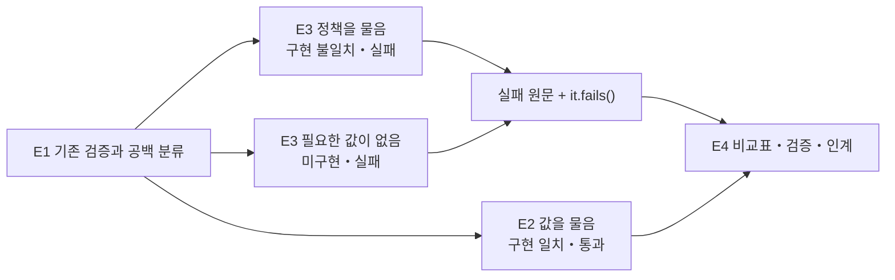

# Lab 14 — 테스트 보강: 의미 있는 assertion 만들기

## 0. 이 랩이 끝나면

- 기존 테스트가 이미 깊게 검증하는 동작과 아직 묻지 않는 동작을 구분합니다.
- `tests/payments.test.ts`, `tests/admin.test.ts`를 만들고 얕은 주문 assertion을 값 중심으로 강화합니다.
- 정책과 구현의 불일치를 실패 원문으로 남기고 `it.fails()`로 인계합니다.
- `notes/assertion-review-l14.md`에 나쁜 통과·좋은 통과·좋은 실패를 비교합니다.

이번 Lab은 **테스트만 보강**합니다. `src/`를 고쳐 테스트를 통과시키지 않습니다. 새 assertion의 결과는 통과, 정책 불일치 발견, 아직 저장할 필드가 없는 미구현으로 갈릴 수 있으며 셋 모두 정상적인 학습 결과입니다. `it.fails()`는 실패를 숨기는 장치가 아니라 “현재는 실패해야 한다”는 기대를 코드로 남겨, 구현이 고쳐져 예상 밖으로 통과하면 표시 제거를 요구하는 장치입니다.

테스트에서 setup은 상황을 만들고, act는 동작을 실행하며, observation은 응답·저장 상태·부수 효과를 꺼냅니다. **Assertion은 그 관찰값을 정책과 비교하는 oracle**입니다. 테스트가 통과했다는 사실과 좋은 질문을 했다는 사실은 다릅니다.

| 결과 | 핵심 값을 묻는가 | 해석 |
| --- | --- | --- |
| 통과 | 아니오 | 구현이 맞는지 아직 모름 |
| 통과 | 예 | 현재 관찰 범위에서 정책과 일치 |
| 실패 | 예 | 정책 불일치 또는 미구현을 발견 |
| 실패 | 아니오 | setup·환경·테스트 자체를 먼저 점검 |

| 좋은 assertion의 판단축 | 확인할 질문 |
| --- | --- |
| 근거 | 기대값을 정책·요구사항에서 찾을 수 있는가? |
| 관찰 | 응답·저장 상태·재고처럼 외부에서 확인할 결과를 묻는가? |
| 회귀 감지 | 중요한 값이 잘못 바뀌면 실제로 실패하는가? |
| 격리 | 단독 실행과 전체 실행에서 같은 결과가 나는가? |

## 1. 시작 전 상태 확인

- 시작 상태는 Lab 12 구현이 완료되고 Lab 13의 fault patch가 제거된 커밋입니다.
- `OrderStatus`는 `pending`, `paid`, `payment_failed`, `cancelled` 네 값입니다.
- 주문 생성은 재고 부족 시 `409 Insufficient stock`으로 미저장·미차감되며, 충분하면 `pending`으로 저장되지만 재고는 차감되지 않습니다.
- 성공 결제만 재고를 한 번 차감해 `paid`와 성공 시도를 남기고, 실패 결제는 재고를 바꾸지 않은 채 `402`·`payment_failed`·실패 시도를 보존합니다.
- Lab 12가 품절 차단, 성공 차감, 결제 시점 품절, 실패 주문 보존과 재결제 거부를 이미 깊게 검증합니다. 이 테스트를 다시 쓰지 않습니다.
- 관리자 구현은 실패 시도로부터 한글 `결제실패`를 파생하고 실패 사유 저장 필드는 없습니다. 기존 테스트의 `creates an order`는 `201`, `gets an order`는 `200`, `lists admin orders`는 `Array.isArray`만 확인합니다.

```bash
git status --short --branch
git log --oneline -3 -- src tests
git diff --stat -- src tests
```

현재 branch와 Lab 12·13의 기준 커밋을 확인합니다. `src/` diff가 있으면 시작하지 않으며, `tests/orders.test.ts`의 기존 깊은 assertion과 얕은 `creates an order`, `gets an order`, `lists admin orders`를 구분해 읽습니다.

## 2. 실습 목표와 산출물

| 단계 | 핵심 개념 | 핵심 작업 | 결과 |
| --- | --- | --- | --- |
| E1 | 검증 공백 선택 | 기존 깊은 검증과 얕은 검증을 분류 | `notes/assertion-review-l14.md` 초안 |
| E2 | 좋은 통과 | 결제 테스트를 분리하고 생성·단건 조회의 값을 검증 | `tests/payments.test.ts`, 강화된 주문 테스트 |
| E3 | 좋은 실패 | 관리자 정책 불일치와 미구현 필드를 원문으로 기록 | `tests/admin.test.ts`, `it.fails()` |
| E4 | 비교와 인계 | 세 결과를 비교하고 전체 검증·커밋 | 완성된 assertion review |



E2와 E3는 성공·실패로 나뉘는 것이 아니라 **정책 질문에 대한 서로 다른 답**입니다. E2는 이미 맞던 구현을 처음으로 판정 가능하게 만들고, E3는 기존 suite가 묻지 않아 보이지 않던 불일치와 미구현을 드러냅니다.

## 3. 실습

### E1. 검증할 케이스와 공백 고르기

#### 설계 질문

- 위험해 보이는 케이스와 실제로 assertion이 비어 있는 케이스는 어떻게 다른가요?
- 상태 코드 외에 저장 상태·재고 값·응답 필드 중 무엇을 관찰해야 하나요?
- Lab 12의 깊은 테스트를 중복하지 않고 남은 공백을 어떻게 찾나요?

#### 판단 기준

| 커리큘럼 후보 | Lab 12에서 이미 묻는 것 | 이번 Lab에서 남은 판단 |
| --- | --- | --- |
| 품절 주문 차단 | `409`, 미저장, 미차감 | 중복 테스트를 만들지 않음 |
| 결제 실패 상태 | `402`, `payment_failed`, 주문·시도 보존, 재고 불변 | 결제 테스트 파일의 책임 분리와 관리자 표시 공백 확인 |
| 관리자 조회 실패 사유 | 아직 저장·응답할 필드가 없음 | 정책 기준 테스트로 미구현을 드러냄 |
| 관리자 목록 기본 검사 | `Array.isArray`만 확인 | 변경 전 나쁜 통과로 기록하고 E3에서 관리자 테스트로 이동·교체 |

테스트 이름이나 통과 여부가 아니라 assertion 원문을 기준으로 검증 범위를 판단합니다. 이미 충분히 검증된 동작은 중복하지 않고, 판정에 필요한 값을 묻지 않는 assertion은 후속 보강 후보로 기록합니다. 이동·교체할 파일은 조사 결과를 사람이 검토한 뒤 결정합니다.

여기서 만드는 것은 테스트 목록이 아니라 **정책–assertion 연결표**입니다. 코드가 실행됐는지가 아니라 정책의 어떤 문장을 어느 assertion이 판정하는지 연결하고, 연결이 이미 있으면 중복 대신 책임 파일만 정리합니다.

#### 실행

```text
@tests/orders.test.ts와 @docs/order-policy.md @docs/payment-policy.md
@docs/inventory-policy.md를 대조해 notes/assertion-review-l14.md 초안을 작성해줘.

주문 생성·조회, 재고 부족, 결제 실패, 관리자 조회에서
기존 assertion이 실제로 보장하는 값과 아직 판정할 수 없는 값을 구분해라.
테스트 이름이 아니라 assertion 원문을 근거로 판단하고,
위험·관찰할 값·정책상 예상 결과·후속 테스트 책임 후보를 표로 정리해라.

아직 테스트나 src는 수정하지 마라.
```

#### 검증

- [ ] 지정된 세 후보가 기존 검증·남은 공백으로 구분됐는가?
- [ ] Lab 12의 깊은 assertion을 다시 작성할 대상으로 잡지 않았는가?
- [ ] `lists admin orders`의 약한 assertion과 E3의 이동 대상이 기록됐는가?
- [ ] 각 공백에 정책 위험과 관찰할 구체 값이 있는가?
- [ ] 테스트와 `src/`가 아직 수정되지 않았는가?

### E2. 통과하는 assertion 보강하기

#### 설계 질문

- 상태 코드만 묻던 테스트에 어떤 값이 추가돼야 회귀를 판정할 수 있나요?
- 결제 경로 테스트를 분리하면서 기존 깊은 assertion을 어떻게 보존하나요?
- 새 assertion의 통과가 구현 일치의 증거가 되려면 무엇을 직접 비교해야 하나요?

#### 판단 기준

| 대상 | 약한 질문 | 강화할 관찰값 |
| --- | --- | --- |
| 주문 생성 | `201`인가 | 응답 주문의 `pending`, 저장된 주문, 생성 전후 재고 동일 |
| 주문 단건 조회 | `200`인가 | 생성한 주문 ID·품목·합계·상태와 조회 응답의 일치 |
| 결제 테스트 분리 | 파일 안에 테스트가 있는가 | Lab 12의 상태·시도·재고 assertion이 약화 없이 유지되는가 |
| 테스트 독립성 | 전체 suite에서 통과하는가 | 초기화 뒤 단독·전체 실행에서 같은 결과가 나는가 |

호출 횟수나 필드 존재만 추가하지 않습니다. 정책이 요구하는 값을 직접 비교하며, 이 단계의 새 assertion은 현재 구현과 일치해 통과해야 합니다.

의미 있는 assertion은 “필드가 있다”에서 끝나지 않고 **어떤 값이, 어느 시점에, 어떤 저장 결과와 함께 있어야 하는지**를 묻습니다. 응답·저장 상태·재고는 API 계약, 영속 상태, 부수 효과라는 서로 다른 관찰면입니다.

#### 실행

```text
@notes/assertion-review-l14.md와 현재 @tests/orders.test.ts를 사용해 tests/payments.test.ts를 만들고 기존 결제 경로 검증을 약화 없이 옮기거나 필요한 최소 구조로 분리해줘. orders.test.ts의 creates an order와 gets an order는 응답 값·저장 상태·재고 값까지 직접 비교하도록 강화해라. Lab 12가 이미 검증한 케이스를 중복 작성하거나 src를 수정하지 말고 관련 테스트를 실행해 결과를 assertion review에 기록해라.
```

#### 검증

- [ ] `tests/payments.test.ts`가 결제 경로의 깊은 assertion을 보존하는가?
- [ ] 생성 테스트가 `pending` 저장과 재고 미차감을 값으로 확인하는가?
- [ ] 단건 조회가 주문 ID·품목·합계·상태의 일치를 확인하는가?
- [ ] 정책상 중요한 값이 잘못 바뀌면 해당 assertion이 실패하며, 테스트가 서로의 저장 상태에 의존하지 않는가?
- [ ] 관련 테스트가 통과하고 `src/` diff가 없는가?

### E3. 정책을 묻는 실패 테스트 남기기

#### 설계 질문

- 실패한 assertion이 잘못된 테스트인지 실제 정책 불일치인지 무엇으로 구분하나요?
- 관리자 표시 상태는 저장된 주문 상태와 실패 시도 중 무엇을 기준으로 해야 하나요?
- 저장 스키마에 없는 실패 사유 요구는 어디로 인계해야 하나요?

#### 판단 기준

| 결과 | 의미 | 처리 |
| --- | --- | --- |
| 관리자 상태 표시 실패 | 정책은 저장 상태 `payment_failed`를 요구하지만 구현은 실패 시도로 `결제실패`를 파생 | 원문 기록 후 `it.fails()` |
| 관리자 실패 사유 실패 | 정책상 추가 저장·제공이 필요하지만 `PaymentAttempt`에 필드가 없음 | 미구현 기록 후 `it.fails()` |

| Vitest 표현 | suite가 주장하는 것 | 이번 Lab의 사용 |
| --- | --- | --- |
| `it()` | 지금 통과해야 함 | 최초 실패 원문 수집 |
| `it.fails()` | 지금 실패해야 하며 통과하면 경고해야 함 | 확인된 불일치·미구현 인계 |
| `it.skip()`·`it.todo()` | 실행하거나 판정하지 않음 | 실패 증거가 사라지므로 사용하지 않음 |

E1에서 기록한 `lists admin orders`는 `orders.test.ts`에서 제거하고 관리자 setup과 함께 `admin.test.ts`로 옮겨 정책 값을 묻는 테스트로 교체합니다. 약한 assertion을 복사해 중복하거나 최종 suite에 남기지 않습니다. 처음에는 일반 `it()`으로 실행해 setup 오류가 아닌 목표 assertion에서 실패하는지 확인하고, 실제 실패 원문을 `notes/assertion-review-l14.md`에 그대로 남깁니다. 그 뒤에만 `it.fails()`로 표시하고, 주석에는 실패 이유와 Lab 15 인계 대상을 적습니다. `it.fails()`는 실패 원인까지 고정하지 않으므로 최초 원문과 정책 근거를 함께 보존합니다. 실패를 지우거나 assertion을 현재 구현에 맞게 완화하지 않습니다.


#### 실행

```text
@notes/assertion-review-l14.md와 @docs/order-policy.md를 기준으로 orders.test.ts의 lists admin orders를 tests/admin.test.ts로 옮기고 기존 Array.isArray assertion을 제거해 정책 값을 묻는 테스트로 교체해줘. 관리자 목록이 저장 상태가 payment_failed일 때만 그 상태를 표시하고 정책이 요구하는 결제 실패 사유를 제공하는지 값으로 검증해라. 먼저 일반 it 테스트로 실행해 각 실패의 명령·종료 코드·첫 관련 에러 원문·파일 위치를 assertion review에 그대로 기록한 뒤, 각 테스트를 it.fails로 바꾸고 실패 이유와 Lab 15 인계 대상을 주석으로 남겨라. 약한 테스트를 중복하거나 실패를 완화하거나 src를 수정하지 마라.
```

#### 검증

- [ ] 관리자 상태 assertion이 한글 파생 문자열이 아니라 정책의 저장 상태를 기대하는가?
- [ ] 실패 사유 assertion이 미구현 필드를 실제로 묻는가?
- [ ] 기존 관리자 테스트가 `admin.test.ts`로 이동·교체되고 `orders.test.ts`에 중복되지 않았는가?
- [ ] `it()`의 최초 실패 원문을 보존한 뒤 `it.fails()`로 전환했는가?
- [ ] 각 `it.fails()`에 사유와 인계 대상이 있고 `src/`는 그대로인가?

### E4. Assertion 비교와 인계 완성하기

#### 설계 질문

- 통과 여부와 assertion 품질은 왜 같은 기준이 아닌가요?
- 실패한 좋은 assertion이 다음 구현에서 어떤 회귀 방지 장치가 되나요?

#### 판단 기준

| 분류 | 질문의 수준 | 결과의 의미 |
| --- | --- | --- |
| 나쁜 통과 | 상태 코드·배열 여부처럼 핵심 값을 묻지 않음 | 구현이 맞는지 판정 불가 |
| 좋은 통과 | 정책이 요구하는 상태·응답·저장·재고 값을 직접 비교 | 현재 구현과 정책이 일치 |
| 좋은 실패 | 정책 값을 직접 비교해 불일치 또는 미구현을 드러냄 | 수정·인계할 근거 발견 |

비교표는 최소 세 행으로 세 분류를 모두 포함합니다. 나쁜 통과는 E1에 보존한 기존 `Array.isArray` assertion을 변경 전 증거로 사용하며 최종 테스트에 남길 필요는 없습니다. `it.fails()`가 있는 전체 suite의 통과는 결함 해결이 아니라 예상된 실패가 계속 재현된다는 뜻이며, 해당 테스트가 실제로 통과하기 시작하면 suite가 실패해 표시 제거를 요구합니다.

따라서 E4의 green suite는 “알려진 문제가 없음”이 아니라 “통과해야 할 테스트는 통과하고, 실패해야 할 테스트는 여전히 실패함”을 뜻합니다. 전체 결과는 assertion review의 실패 원문·인계 항목과 함께 읽어야 합니다.

#### 실행

```text
@notes/assertion-review-l14.md를 완성해 E1에 기록한 lists admin orders의 기존 Array.isArray assertion을 나쁜 통과로, 값 중심으로 강화해 통과한 assertion을 좋은 통과로, 관리자 정책 불일치·미구현을 찾은 assertion을 좋은 실패로 최소 한 행씩 비교해줘. 각 행에 질문한 값, 정책 근거, 실제 결과와 다음 조치를 적고 npm test, npm run lint, npm run typecheck를 실행해 실제 결과를 기록해라. tests 변경과 assertion review만 커밋하고 src·정책·AGENTS.md는 수정하거나 커밋하지 마라.
```

#### 검증

- [ ] 비교표가 최소 세 행이며 세 분류를 모두 포함하는가?
- [ ] 나쁜 통과가 최종 suite에 남은 약한 테스트가 아니라 E1의 변경 전 기록을 근거로 하는가?
- [ ] 실패한 테스트를 삭제·완화하지 않고 `it.fails()`로 인계했는가?
- [ ] 전체 test·lint·typecheck의 실제 결과와 미실행 항목이 구분됐는가?
- [ ] 커밋에 assertion review와 `tests/`만 있고 `src/` 순변경은 없는가?

## 4. Self-check

```bash
node labs/tools/check.mjs 14
git show --stat --oneline HEAD
git diff HEAD^ HEAD -- src
```

- [ ] 필수 산출물 세 개와 앱 검사가 확인됐는가?
- [ ] 기존 깊은 assertion은 유지되고 얕은 assertion만 값 중심으로 강화됐는가?
- [ ] 관리자 불일치·미구현의 실패 원문과 `it.fails()` 인계가 연결되는가?
- [ ] Lab 14 커밋의 `src/` 순변경이 없는가?

Self-check는 테스트 개수보다 증거의 연결을 봅니다. 정책 문장, 관찰값, assertion, 실제 결과, 다음 조치가 한 흐름으로 이어져야 완료입니다.

## 5. 자주 하는 실수

- 새 테스트가 실패하자 정책 대신 `src/`를 바꿉니다.
- 호출 횟수와 필드 존재만 늘리고 상태·응답·저장·재고 값을 검증하지 않습니다.
- 실패 원문을 요약으로 바꾸거나 기록하기 전에 `it.fails()`로 감쌉니다.
- 실패 테스트를 삭제·완화하거나 `it.fails()`를 영구적인 무시 표시처럼 사용합니다.

## 6. 다음 lab으로 넘기는 것

Lab 15에는 `it.fails()`로 표시한 관리자 테스트와 실패 원문을 넘깁니다. 이 테스트들은 `src/admin.ts`의 `catch { res.json([]) }`와 `src/payments.ts`의 `catch (e) { console.log(e) }` 같은 silent fallback을 제거할 때 정책 상태·실패 정보가 다시 사라지지 않게 하는 회귀 방지 장치가 됩니다.

Lab 14 커밋에는 `tests/`와 `notes/assertion-review-l14.md`만 있으며 `src/` 순변경은 없어야 합니다.
